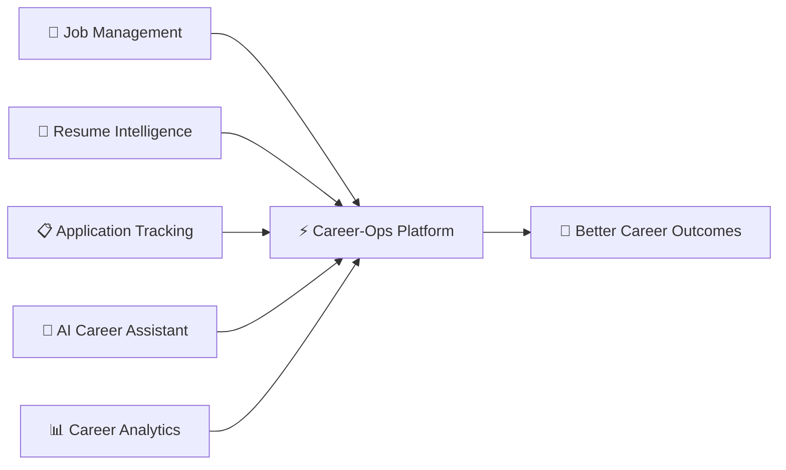
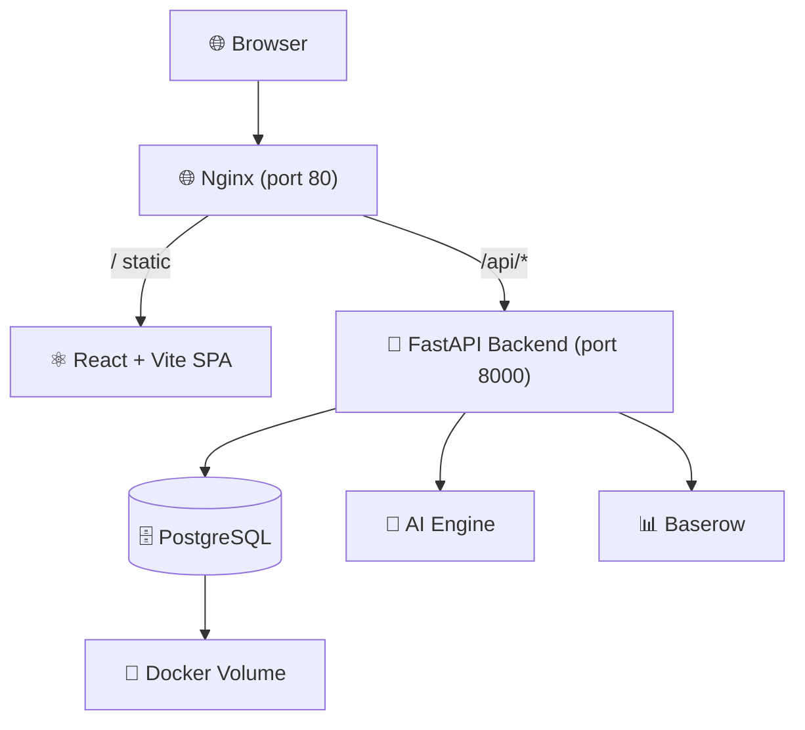

<div align="center">
  <br/>
  <picture>
    <source media="(prefers-color-scheme: dark)" srcset="https://img.shields.io/badge/Career--Ops-v2-6366f1?style=for-the-badge&logo=data:image/svg+xml;base64,PHN2ZyB4bWxucz0iaHR0cDovL3d3dy53My5vcmcvMjAwMC9zdmciIHdpZHRoPSI0MCIgaGVpZ2h0PSI0MCIgdmlld0JveD0iMCAwIDI0IDI0IiBmaWxsPSJub25lIiBzdHJva2U9IiNmZmYiIHN0cm9rZS13aWR0aD0iMiIgc3Ryb2tlLWxpbmVjYXA9InJvdW5kIiBzdHJva2UtbGluZWpvaW49InJvdW5kIj48cmVjdCB3aWR0aD0iMjAiIGhlaWdodD0iMTQiIHg9IjIiIHk9IjciIHJ4PSIyIiAvPjxwYXRoIGQ9Ik0xNiAyMUg4di0zaDh6Ii8+PC9zdmc+">
    
  </picture>

  <br/><br/>

  <h1 align="center">🚀 Career-Ops v2</h1>
  <p align="center">
    <strong>AI-Powered Career Operating System</strong>
    <br/>
    <em>Manage · Optimize · Automate your entire career journey</em>
  </p>

  <br/>

  <!-- Badges Row 1 -->
  <p>
    
    
    
    
  </p>

  <!-- Badges Row 2 -->
  <p>
    
    
    
    
  </p>

  <!-- Badges Row 3 -->
  <p>
    
    
    
  </p>

  <br/>

  <div align="center">
    <a href="#-features">Features</a> •
    <a href="#-modules">Modules</a> •
    <a href="#-quick-start">Quick Start</a> •
    <a href="#-api-reference">API</a> •
    <a href="#-deployment">Deployment</a> •
    <a href="#-architecture">Architecture</a> •
    <a href="#-contributing">Contributing</a>
  </div>

  <br/>
  <hr/>
</div>

---

## 📋 Overview

**Career-Ops v2** is a unified, AI-powered platform that transforms how professionals manage their career journey. Instead of juggling multiple disconnected tools for resumes, job tracking, applications, and interview prep, Career-Ops brings everything together in one intelligent ecosystem.



---

## 🌟 Features

<div align="center">
  <table>
    <tr>
      <td align="center" width="33%">
        <h3>🎯 Job Management</h3>
        <p>Track, search, and organize job opportunities with powerful filtering and status tracking</p>
      </td>
      <td align="center" width="33%">
        <h3>📄 Resume Intelligence</h3>
        <p>Upload, parse, and analyze resumes with AI-powered extraction of skills, experience, and education</p>
      </td>
      <td align="center" width="33%">
        <h3>📋 Application Tracking</h3>
        <p>Monitor every stage from submission to offer with status changes and notes</p>
      </td>
    </tr>
    <tr>
      <td align="center">
        <h3>🤖 AI Career Assistant</h3>
        <p>ATS scoring, interview questions, resume optimization — all powered by built-in AI engines</p>
      </td>
      <td align="center">
        <h3>📊 Career Analytics</h3>
        <p>Visual dashboards with real-time stats on jobs, applications, interviews, and progress</p>
      </td>
      <td align="center">
        <h3>🔐 Secure & Scalable</h3>
        <p>JWT auth with RBAC, PostgreSQL, Docker Compose deployment, ready for EC2/RHEL</p>
      </td>
    </tr>
  </table>
</div>

---

## 🧩 Modules

### Backend (FastAPI + Python 3.12)

| Module | Endpoints | Description |
|--------|-----------|-------------|
| 🔐 **Auth** | `/api/v1/auth/*` | JWT authentication, registration, login, refresh tokens |
| 👤 **Users** | `/api/v1/users/*` | User profiles, registration, role management |
| 💼 **Jobs** | `/api/v1/jobs/*` | Full CRUD, search, filter, sort, pagination, job matching |
| 📋 **Applications** | `/api/v1/applications/*` | Application tracking with status lifecycle |
| 📄 **Resumes** | `/api/v1/resumes/*` | Upload, download, preview, parse, extract intelligence |
| 📊 **Dashboard** | `/api/v1/dashboard/*` | Aggregated stats, recent activity, status summaries |
| 🤖 **AI Engine** | `/api/v1/ai/*` | ATS scoring, interview questions, resume optimization |
| 🛡️ **Admin** | `/api/v1/admin/*` | Admin health checks, system monitoring |
| 📊 **Baserow** | `/api/v1/baserow/*` | No-code database CRUD integration |
| 🎯 **Job Matching** | `/api/v1/jobs/{id}/match/*` | AI-powered resume-to-job matching |

### Frontend (React 19 + Vite 8 + TypeScript 6)

| Page | Route | Features |
|------|-------|----------|
| 🏠 **Landing** | `/` | Hero, features grid, stats, CTA with Framer Motion |
| 🔐 **Login** | `/login` | JWT login with auto-refresh, password toggle |
| 📝 **Register** | `/register` | Full registration with validation |
| 📊 **Dashboard** | `/dashboard` | Stat cards, recent jobs, recent applications |
| 💼 **Jobs** | `/jobs` | Search, create modal, status badges, delete |
| 📋 **Applications** | `/applications` | CRUD with status tracking (6 states) |
| 📄 **Resumes** | `/resumes` | Drag-to-upload, file list, download, delete |
| 🤖 **AI Tools** | `/ai` | ATS Calculator + Interview Question Generator |

---

## 🏗️ Architecture



```
┌──────────────────────────────────────────────────────────┐
│                    Frontend (React 19)                    │
│  Landing · Login · Register · Dashboard · Jobs           │
│  Applications · Resumes · AI Tools                       │
└──────────────────────┬───────────────────────────────────┘
                       │ Axios (JWT Bearer Token)
                       ▼
┌──────────────────────────────────────────────────────────┐
│              Nginx Reverse Proxy (port 80)                │
│         Serves static files + proxies /api/*              │
└──────────────────────┬───────────────────────────────────┘
                       │
                       ▼
┌──────────────────────────────────────────────────────────┐
│                FastAPI Backend (Python 3.12)               │
│  ┌─────────┐ ┌──────────┐ ┌──────────┐ ┌────────────┐   │
│  │ Routers │→│ Services │→│  Repos   │→│  Models    │   │
│  │  10 mods│ │  8 svcs  │ │  9 repos │ │  8 tables  │   │
│  └─────────┘ └──────────┘ └──────────┘ └────────────┘   │
│              │             │            │                  │
│              ▼             ▼            ▼                  │
│         🤖 AI Engine  📊 Baserow   🗄 SQLAlchemy         │
└──────────────────────────────────────────────────────────┘
```

---

## 🚀 Quick Start

### Prerequisites
- Python 3.12+
- Node.js 22+ / Bun 1.3+
- Docker & Docker Compose (for production)

### Development

```bash
# 1. Clone the repository
git clone https://github.com/kmrgautam18-alt/career-ops-v2.git
cd career-ops-v2

# 2. Start the backend
pip install -r requirements.txt
mkdir -p data
DATABASE_URL='sqlite:///./data/careerops.db' \
SECRET_KEY='dev-secret' \
uvicorn backend.app.main:app --host 0.0.0.0 --port 8000 --reload

# 3. Start the frontend (in a new terminal)
cd frontend
bun install
bun dev
```

Open **http://localhost:5173** for the app and **http://localhost:8000/docs** for the API docs.

### One-Command Preview

```bash
bash scripts/preview.sh
```

---

## 📖 API Reference

Full interactive Swagger documentation is available at **`/docs`** when the server is running.

### Authentication

```bash
# Register
curl -X POST http://localhost:8000/api/v1/users/register \
  -H 'Content-Type: application/json' \
  -d '{"email":"user@example.com","password":"SecurePass123!","username":"johndoe","full_name":"John Doe"}'

# Login
curl -X POST http://localhost:8000/api/v1/auth/login \
  -H 'Content-Type: application/json' \
  -d '{"email":"user@example.com","password":"SecurePass123!"}'
```

### Core Endpoints

| Method | Endpoint | Description |
|--------|----------|-------------|
| `POST` | `/api/v1/auth/login` | Sign in (returns JWT) |
| `POST` | `/api/v1/users/register` | Create account |
| `GET` | `/api/v1/users/me` | Current user profile |
| `GET` | `/api/v1/jobs` | List jobs (search, filter, sort) |
| `POST` | `/api/v1/jobs` | Create job |
| `GET` | `/api/v1/applications` | List applications |
| `GET` | `/api/v1/dashboard/` | Career overview stats |
| `POST` | `/api/v1/ai/ats-score` | Calculate ATS compatibility |

> Full documentation with all 134 endpoints available at `/docs`.

---

## 🐳 Deployment

### Docker Compose (Production)

```bash
# 1. Configure environment
cp .env.example .env
# Edit .env with your production values

# 2. Start the stack
docker compose up -d --build

# 3. Run migrations
docker compose exec backend alembic upgrade head
```

### RHEL 10.2 / Fedora

```bash
sudo bash scripts/deploy-rhel.sh
```

### AWS EC2

```bash
EC2_HOST="ec2-xx-xx-xx-xx.compute-1.amazonaws.com" \
EC2_SSH_KEY="~/.ssh/key.pem" \
bash scripts/deploy-ec2.sh
```

---

## 🧪 Testing

```bash
# Backend (98 tests)
python3 -m pytest tests/ -q

# Frontend typecheck
cd frontend && bun tsc -b --noEmit

# Frontend production build
cd frontend && bun run build
```

---

## 🔧 Integrations

| Integration | Description | Status |
|-------------|-------------|:------:|
| 🗄️ **Baserow** | No-code database / Airtable alternative — CRUD via REST API | ✅ |
| 🧠 **Claude Code** | AI coding assistant with full project context via `CLAUDE.md` | ✅ |
| ☁️ **AWS EC2** | Automated deployment with bootstrap + deploy scripts | ✅ |
| 🐳 **Docker** | Multi-service Compose: PostgreSQL + Backend + Nginx | ✅ |
| 🖥️ **RHEL** | Automated deployment script for Red Hat Enterprise Linux | ✅ |

---

## 📂 Project Structure

```
.
├── backend/
│   └── app/
│       ├── api/v1/           # 10 route modules
│       ├── core/             # Config, settings
│       ├── database/         # Engine, session, migrations
│       ├── models/           # 8 SQLAlchemy models
│       ├── schemas/          # Pydantic schemas
│       ├── services/         # Business logic + AI + Baserow
│       ├── repositories/     # Data access layer
│       ├── security/         # JWT + password hashing
│       ├── knowledge/        # Resume/skill extraction
│       ├── resources/        # Knowledge base files
│       └── main.py           # App entry point
├── frontend/
│   └── src/
│       ├── api/              # Axios client (JWT interceptors)
│       ├── components/       # Layout, Sidebar, ProtectedRoute
│       ├── context/          # AuthContext
│       └── pages/            # 8 pages
├── docs/                     # 40+ docs (architecture, diagrams, blueprints)
├── scripts/                  # EC2, RHEL, preview, dev scripts
├── tests/                    # 98 passing tests
├── .claude/                  # Claude Code config
├── docker-compose.yml        # Full production stack
├── Dockerfile                # Multi-stage backend build
└── README.md                 # This file
```

---

## 📊 Project Status

| Area | Status |
|------|:------:|
| Backend API | ✅ 134 endpoints, 10 modules |
| Frontend UI | ✅ 8 pages, dark theme, responsive |
| Authentication | ✅ JWT + Argon2 + RBAC |
| AI Features | ✅ ATS scoring, interview questions, optimization |
| Database | ✅ SQLite (dev) / PostgreSQL (prod) |
| Tests | ✅ 98/98 passing |
| Docker | ✅ Multi-service compose |
| CI/CD | ✅ Scripts ready (EC2, RHEL) |
| Documentation | ✅ 40+ files, 17 diagrams |

---

## 🤝 Contributing

Contributions are welcome! Please see [CONTRIBUTING.md](.github/CONTRIBUTING.md) for guidelines.

1. Fork the repository
2. Create a feature branch (`git checkout -b feature/amazing-feature`)
3. Commit changes (`git commit -m 'Add amazing feature'`)
4. Push to the branch (`git push origin feature/amazing-feature`)
5. Open a Pull Request

---

## 📄 License

This project is **MIT Licensed** — see the [LICENSE](LICENSE) file for details.

---

## 👨‍💻 Author

**Kumar Gautam**

<p>
  <a href="https://github.com/kmrgautam18-alt">
    
  </a>
</p>

---

<div align="center">
  <p>
    <strong>Built with ❤️ using FastAPI + React + PostgreSQL</strong>
    <br/>
    <em>Career-Ops v2 — Your Career, Supercharged by AI</em>
  </p>
  <p>
    <a href="https://github.com/kmrgautam18-alt/career-ops-v2">
      
    </a>
    <a href="https://github.com/kmrgautam18-alt/career-ops-v2/fork">
      
    </a>
  </p>
</div>
