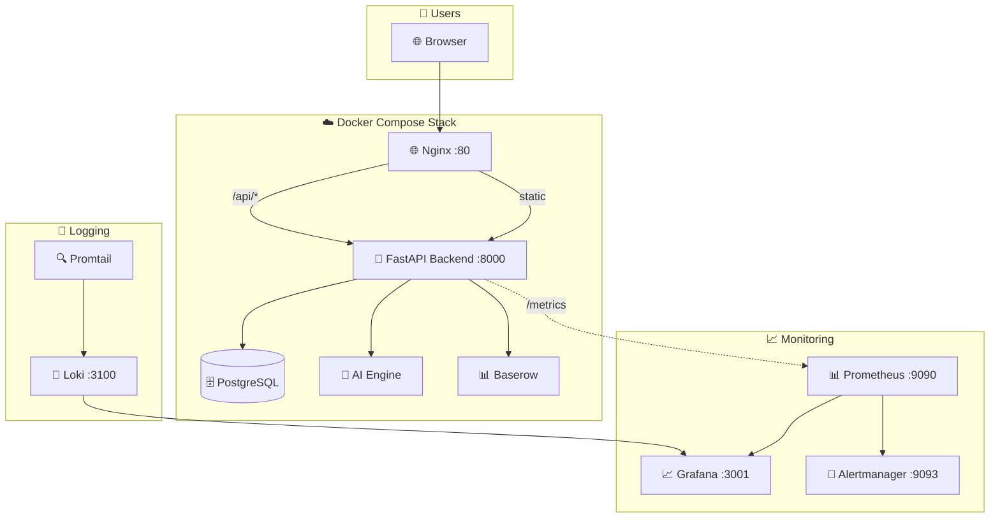
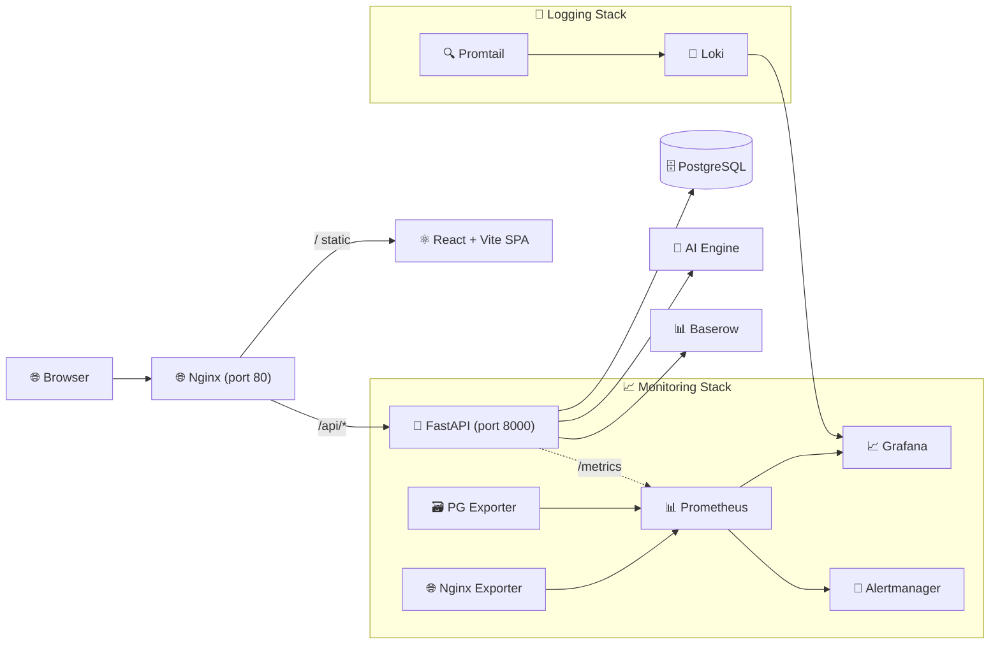

<div align="center">
  <br/>
  <picture>
    <source media="(prefers-color-scheme: dark)" srcset="https://img.shields.io/badge/Career--Ops-v2-6366f1?style=for-the-badge&logo=data:image/svg+xml;base64,PHN2ZyB4bWxucz0iaHR0cDovL3d3dy53My5vcmcvMjAwMC9zdmciIHdpZHRoPSI0MCIgaGVpZ2h0PSI0MCIgdmlld0JveD0iMCAwIDI0IDI0IiBmaWxsPSJub25lIiBzdHJva2U9IiNmZmYiIHN0cm9rZS13aWR0aD0iMiIgc3Ryb2tlLWxpbmVjYXA9InJvdW5kIiBzdHJva2UtbGluZWpvaW49InJvdW5kIj48cmVjdCB3aWR0aD0iMjAiIGhlaWdodD0iMTQiIHg9IjIiIHk9IjciIHJ4PSIyIiAvPjxwYXRoIGQ9Ik0xNiAyMUg4di0zaDh6Ii8+PC9zdmc+">
    
  </picture>

  <br/><br/>

  <h1 align="center">🚀 Career-Ops v2</h1>
  <p align="center">
    <strong>AI-Powered Career Operating System</strong>
    <br/>
    <em>Manage · Optimize · Automate your entire career journey</em>
  </p>

  <br/>

  <!-- Badges Row 1 — Core Stack -->
  <p>
    
    
    
    
  </p>

  <!-- Badges Row 2 — Quality & Database -->
  <p>
    
    
    
    
  </p>

  <!-- Badges Row 3 — Monitoring & AI -->
  <p>
    
    
    
    
  </p>

  <!-- Badges Row 4 — License & Status -->
  <p>
    
    
    
  </p>

  <br/>

  <div align="center">
    <a href="#-features">Features</a> •
    <a href="#-modules">Modules</a> •
    <a href="#-quick-start">Quick Start</a> •
    <a href="#-api-reference">API</a> •
    <a href="#-deployment">Deployment</a> •
    <a href="#-monitoring--alerting">Monitoring</a> •
    <a href="#-architecture">Architecture</a>
  </div>

  <br/>
  <hr/>
</div>

---

## 📋 Overview

**Career-Ops v2** is a unified, AI-powered platform that transforms how professionals manage their career journey. Instead of juggling multiple disconnected tools for resumes, job tracking, applications, and interview prep, Career-Ops brings everything together in one intelligent ecosystem — with enterprise-grade monitoring, alerting, and logging built in.



---

## 🌟 Features

<div align="center">
  <table>
    <tr>
      <td align="center" width="33%">
        <h3>🎯 Job Management</h3>
        <p>Track, search, and organize job opportunities with powerful filtering and status tracking</p>
      </td>
      <td align="center" width="33%">
        <h3>📄 Resume Intelligence</h3>
        <p>Upload, parse, and analyze resumes with AI-powered extraction of skills, experience, and education</p>
      </td>
      <td align="center" width="33%">
        <h3>📋 Application Tracking</h3>
        <p>Monitor every stage from submission to offer with status changes and notes</p>
      </td>
    </tr>
    <tr>
      <td align="center">
        <h3>🤖 AI Career Assistant</h3>
        <p>ATS scoring, interview questions, resume optimization, job matching — all powered by Google Gemini AI with <strong>streaming SSE responses</strong></p>
      </td>
      <td align="center">
        <h3>📊 Career Analytics</h3>
        <p>Visual dashboards with real-time stats on jobs, applications, interviews, and progress</p>
      </td>
      <td align="center">
        <h3>🔐 Secure & Scalable</h3>
        <p>JWT auth with RBAC, PostgreSQL, Docker Compose deployment, ready for EC2/RHEL</p>
      </td>
    </tr>
    <tr>
      <td align="center">
        <h3>📊 Prometheus Metrics</h3>
        <p>15+ metric types tracking HTTP requests, DB queries, AI performance, and business KPIs</p>
      </td>
      <td align="center">
        <h3>📈 Grafana Dashboards</h3>
        <p>12-panel pre-built dashboard with auto-provisioned Prometheus + Loki datasources</p>
      </td>
      <td align="center">
        <h3>🔔 Smart Alerting</h3>
        <p>14 alerting rules routed to Slack, PagerDuty, and/or Email via Alertmanager</p>
      </td>
    </tr>
    <tr>
      <td align="center">
        <h3>📝 Loki Log Aggregation</h3>
        <p>Centralized Docker container logs with Promtail, queryable in Grafana Explore</p>
      </td>
      <td align="center">
        <h3>🌗 Dark/Light Theme</h3>
        <p>Toggleable dark luxury / metallic light theme with smooth Framer Motion transitions</p>
      </td>
      <td align="center">
        <h3>🎬 Page Transitions</h3>
        <p>Direction-aware slide animations, loading skeletons, progress bars, and avatar trail</p>
      </td>
    </tr>
  </table>
</div>

---

## 🧩 Modules

### Backend (FastAPI + Python 3.12)

| Module | Endpoints | Description |
|--------|-----------|-------------|
| 🔐 **Auth** | `/api/v1/auth/*` | JWT authentication, registration, login, refresh tokens |
| 👤 **Users** | `/api/v1/users/*` | User profiles, registration, role management |
| 💼 **Jobs** | `/api/v1/jobs/*` | Full CRUD, search, filter, sort, pagination, job matching |
| 📋 **Applications** | `/api/v1/applications/*` | Application tracking with status lifecycle |
| 📄 **Resumes** | `/api/v1/resumes/*` | Upload, download, preview, parse, extract intelligence |
| 📊 **Dashboard** | `/api/v1/dashboard/*` | Aggregated stats, recent activity, status summaries |
| 🤖 **AI Engine** | `/api/v1/ai/*` | ATS scoring, interview questions, resume optimization, job matching |
| 🛡️ **Admin** | `/api/v1/admin/*` | Admin health checks, system monitoring |
| 📊 **Baserow** | `/api/v1/baserow/*` | No-code database CRUD integration |
| 🎯 **Job Matching** | `/api/v1/jobs/{id}/match/*` | AI-powered resume-to-job matching |
| 📈 **Metrics** | `GET /metrics` | Prometheus metrics (HTTP, DB, AI, business) |

### Frontend (React 19 + Vite 8 + TypeScript 6)

| Page | Route | Features |
|------|-------|----------|
| 🏠 **Landing** | `/` | Hero, features grid, stats, CTA with Framer Motion animations |
| 🔐 **Login** | `/login` | JWT login with auto-refresh, password toggle |
| 📝 **Register** | `/register` | Full registration with validation |
| 📊 **Dashboard** | `/dashboard` | Gradient stat cards, recent jobs, recent applications |
| 💼 **Jobs** | `/jobs` | Search, create modal, status badges, delete with animations |
| 📋 **Applications** | `/applications` | CRUD with 6 status states, tracking |
| 📄 **Resumes** | `/resumes` | Drag-to-upload, progress bars, file list, download, delete |
| 🤖 **AI Tools** | `/ai` | ATS Calculator, Interview Questions, Resume Optimizer, Job Match — all with **Stream/Batch toggle** |

### Monitoring (Prometheus + Grafana + Alertmanager)

| Component | Port | Metrics Collected |
|-----------|------|------------------|
| 📊 **Prometheus** | `:9090` | Scrapes `/metrics` from all services every 15s |
| 📈 **Grafana** | `:3001` | 12-panel dashboard + Loki log explorer (auto-provisioned) |
| 🔔 **Alertmanager** | `:9093` | 14 rules → Slack, PagerDuty, Email routing |
| 📊 **Postgres Exporter** | `:9187` | PostgreSQL performance & health metrics |
| 🌐 **Nginx Exporter** | `:9113` | Request count, connections, status metrics |

### Logging (Loki + Promtail)

| Component | Purpose |
|-----------|---------|
| 📝 **Loki** | Centralized log storage with 7-day retention |
| 🔍 **Promtail** | Scrapes Docker container logs + backend app logs |

---

## 🏗️ Architecture



```
┌──────────────────────────────────────────────────────────────┐
│                    Frontend (React 19 + TypeScript 6)          │
│  Landing · Login · Register · Dashboard · Jobs · Applications │
│  Resumes · AI Tools (Streaming SSE)                          │
└────────────────────────┬─────────────────────────────────────┘
                         │ Axios (JWT Bearer Token)
                         ▼
┌──────────────────────────────────────────────────────────────┐
│                Nginx Reverse Proxy (port 80)                  │
│           Serves static files + proxies /api/*                │
│           stub_status at /nginx-status for metrics            │
└──────────────────────┬───────────────────────────────────────┘
                       │
                       ▼
┌──────────────────────────────────────────────────────────────┐
│                  FastAPI Backend (Python 3.12)                 │
│  ┌─────────┐ ┌──────────┐ ┌──────────┐ ┌────────────┐       │
│  │ Routers │→│ Services │→│  Repos   │→│  Models    │       │
│  │  10 mods│ │  8 svcs  │ │  9 repos │ │  8 tables  │       │
│  └─────────┘ └──────────┘ └──────────┘ └────────────┘       │
│              │             │            │                      │
│              ▼             ▼            ▼                      │
│         🤖 AI Engine  📊 Baserow   🗄 SQLAlchemy              │
│         (Gemini AI)    (No-code DB)  + Alembic migrations     │
└──────────────────────────────────────────────────────────────┘
```

---

## 🚀 Quick Start

### Prerequisites
- Python 3.12+
- Node.js 22+ / Bun 1.3+
- Docker & Docker Compose (for production)

### Development

```bash
# 1. Clone the repository
git clone https://github.com/kmrgautam18-alt/career-ops-v2.git
cd career-ops-v2

# 2. Start the backend
pip install -r requirements.txt
mkdir -p data
DATABASE_URL='sqlite:///./data/careerops.db' \
SECRET_KEY='dev-secret' \
uvicorn backend.app.main:app --host 0.0.0.0 --port 8000 --reload

# 3. Start the frontend (in a new terminal)
cd frontend
bun install
bun dev
```

Open **http://localhost:5173** for the app and **http://localhost:8000/docs** for the API docs.

---

## 📖 API Reference

Full interactive Swagger documentation is available at **`/docs`** or **`/api/docs`** when the server is running.

### Authentication

```bash
# Register
curl -X POST http://localhost:8000/api/v1/users/register \
  -H 'Content-Type: application/json' \
  -d '{"email":"user@example.com","password":"SecurePass123!","username":"johndoe","full_name":"John Doe"}'

# Login
curl -X POST http://localhost:8000/api/v1/auth/login \
  -H 'Content-Type: application/json' \
  -d '{"email":"user@example.com","password":"SecurePass123!"}'
```

### Core Endpoints

| Method | Endpoint | Description |
|--------|----------|-------------|
| `POST` | `/api/v1/auth/login` | Sign in (returns JWT) |
| `POST` | `/api/v1/users/register` | Create account |
| `GET` | `/api/v1/users/me` | Current user profile |
| `GET` | `/api/v1/jobs` | List jobs (search, filter, sort) |
| `POST` | `/api/v1/jobs` | Create job |
| `GET` | `/api/v1/applications` | List applications |
| `GET` | `/api/v1/dashboard/` | Career overview stats |
| `POST` | `/api/v1/ai/ats-score` | ATS compatibility (batch) |
| `POST` | `/api/v1/ai/ats-score/stream` | ATS compatibility (streaming SSE) |
| `POST` | `/api/v1/ai/interview/questions` | Generate interview questions (batch) |
| `POST` | `/api/v1/ai/interview/questions/stream` | Generate interview questions (streaming SSE) |
| `POST` | `/api/v1/ai/resume-optimize` | Optimize resume (batch) |
| `POST` | `/api/v1/ai/resume-optimize/stream` | Optimize resume (streaming SSE) |
| `POST` | `/api/v1/ai/job-match` | Match resume to job (batch) |
| `POST` | `/api/v1/ai/job-match/stream` | Match resume to job (streaming SSE) |
| `GET` | `/metrics` | Prometheus metrics |

> Full documentation with all 134 endpoints available at `/docs`.

---

## 🐳 Deployment

### 📖 Step-by-Step Deployment Guides

| Platform | Guide | Difficulty |
|----------|-------|:----------:|
| 🖥️ **RHEL 10.2 / Fedora** | [📄 Full Guide](docs/deployment/rhel-vm-deployment.md) | 🟢 Beginner |
| ☁️ **AWS EC2 (Ubuntu)** | [📄 Full Guide](docs/deployment/aws-ec2-deployment.md) | 🟢 Beginner |
| 🪟 **Windows 10 / 11 (WSL2)** | [📄 Full Guide](docs/deployment/windows10-deployment-guide.md) | 🟢 Beginner |

### Quick Deploy (Docker Compose)

```bash
# 1. Configure environment (edit .env with your secrets)
cp .env.example .env
nano .env

# 2. Build and start the full stack (10 services)
docker compose up -d --build

# 3. Run database migrations
docker compose exec backend alembic upgrade head
```

### Deployed Services

| Service | Port | Purpose |
|---------|------|---------|
| 🌐 Frontend (Nginx) | `:80` | React SPA + API proxy |
| 🚀 Backend (FastAPI) | `:8000` | API + AI engine |
| 📊 Prometheus | `:9090` | Metrics collection |
| 📈 Grafana | `:3001` | Dashboards (admin / password) |
| 🔔 Alertmanager | `:9093` | Alert routing |
| 📝 Loki | `:3100` | Log aggregation |
| 🗄️ PostgreSQL | `:5432` | Database |
| 🗃️ Postgres Exporter | `:9187` | DB metrics |
| 🌐 Nginx Exporter | `:9113` | Web metrics |

---

## 📊 Monitoring & Alerting

### Pre-built Grafana Dashboard

When you deploy the full stack, Grafana auto-provisions:

- **Datasource:** Prometheus (`prometheus:9090`)
- **Datasource:** Loki (`loki:3100`)
- **Dashboard:** Career-Ops v2 — Production Overview (12 panels)

### Dashboard Panels

| Panel | Type | Metrics |
|-------|------|---------|
| API Request Rate | Stat + Area | `rate(careerops_http_requests_total[5m])` |
| Active Requests | Stat + Area | `careerops_http_active_requests` |
| App Uptime | Stat | `careerops_up` |
| Response Duration | Time Series | p95 + p50 latency |
| HTTP Status Codes | Bar Gauge | 2xx / 4xx / 5xx rate |
| AI Request Volume | Time Series | Rate per AI feature |
| AI Request Duration | Time Series | Average per AI feature |
| Business Metrics | 4 Stats | Users / Jobs / Apps / Resumes |
| Applications by Status | Pie Chart | Pipeline distribution |
| DB Query Duration | Time Series | p95 per operation |

### Alerting Rules (14 rules)

| Alert | Severity | Threshold | Notification |
|-------|:--------:|-----------|:-----------:|
| Backend Down | 🔴 Critical | `up == 0` for 1m | Slack + PagerDuty |
| High Error Rate | 🔴 Critical | > 5% 5xx rate for 3m | Slack + PagerDuty |
| High Latency | 🟡 Warning | p95 > 2s for 5m | Slack |
| Postgres Down | 🔴 Critical | `up == 0` for 1m | Slack + PagerDuty |
| Slow DB Queries | 🟡 Warning | p95 > 0.5s for 5m | Slack |
| Disk Space Low | 🔴 Critical | < 10% free for 5m | Slack + PagerDuty |
| High AI Latency | 🟡 Warning | Avg > 30s for 5m | Slack |
| No New Users | ℹ️ Info | Zero signups for 48h | Silenced |

---

## 🧪 Testing

```bash
# Backend (98 tests)
python3 -m pytest tests/ -q

# Frontend typecheck
cd frontend && bun tsc -b --noEmit

# Frontend production build
cd frontend && bun run build
```

---

## 🔧 Integrations

| Integration | Description | Status |
|-------------|-------------|:------:|
| 🗄️ **Baserow** | No-code database / Airtable alternative — CRUD via REST API | ✅ |
| 🧠 **Claude Code** | AI coding assistant with full project context via `CLAUDE.md` | ✅ |
| ☁️ **AWS EC2** | [Automated deployment guide](docs/deployment/aws-ec2-deployment.md) | ✅ |
| 🖥️ **RHEL 10.2** | [Automated deployment guide](docs/deployment/rhel-vm-deployment.md) | ✅ |
| 🐳 **Docker** | Multi-service Compose: 10 services total | ✅ |
| 🧠 **Google Gemini** | AI-powered ATS, interviews, resume optimization, job matching | ✅ |
| 📊 **Prometheus** | Metrics collection for HTTP, DB, AI, business | ✅ |
| 📈 **Grafana** | Pre-built 12-panel dashboard + Loki log explorer | ✅ |
| 🔔 **Alertmanager** | Alert routing to Slack, PagerDuty, Email (configurable) | ✅ |
| 📝 **Loki + Promtail** | Centralized Docker log aggregation with Grafana integration | ✅ |

---

## 📂 Project Structure

```
.
├── backend/
│   └── app/
│       ├── api/v1/           # 10 route modules (auth, users, jobs, apps, resumes, AI, admin, etc.)
│       ├── core/             # Config, settings
│       ├── database/         # Engine, session, migrations
│       ├── models/           # 8 SQLAlchemy models
│       ├── schemas/          # Pydantic schemas
│       ├── services/         # Business logic + AI (ATS, interviews, optimizer, job match)
│       ├── repositories/     # Data access layer
│       ├── security/         # JWT + password hashing
│       ├── knowledge/        # Resume/skill extraction
│       ├── resources/        # Knowledge base files
│       └── main.py           # App entry point + /metrics endpoint
├── frontend/
│   └── src/
│       ├── api/              # Axios client (JWT interceptors + streaming SSE support)
│       ├── components/       # Layout, Sidebar (luxury dark theme + theme toggle)
│       ├── context/          # AuthContext + ThemeContext
│       └── pages/            # 8 pages (Framer Motion transitions, skeletons, direction indicators)
├── monitoring/               # Full observability stack
│   ├── prometheus.yml         # Prometheus scrape config (5 jobs)
│   ├── prometheus-rules.yml   # 14 alerting rules (5 rule groups)
│   ├── alertmanager/          # Alertmanager config (Slack, PagerDuty, Email, Null receivers)
│   ├── grafana/
│   │   ├── datasources/       # Auto-provisioned Prometheus + Loki datasources
│   │   └── dashboards/        # Pre-built CareerOps overview dashboard (12 panels)
│   └── loki/
│       ├── loki-config.yml    # Loki single-binary config
│       └── promtail-config.yml # Docker log scraping config
├── docs/
│   ├── api/                   # API documentation
│   ├── architecture/          # Architecture & design docs
│   ├── blueprint/             # Product blueprints
│   ├── database/              # Schema documentation
│   ├── deployment/            # Deployment guides (RHEL, AWS EC2)
│   ├── diagrams/              # System diagrams (17 files)
│   └── requirements/          # Requirements docs
├── scripts/                   # EC2 deploy, RHEL deploy, preview scripts
├── tests/                     # 98 passing tests
├── docker-compose.yml         # 10 services: PostgreSQL, Backend, Frontend, Prometheus, Grafana,
│                              #   Alertmanager, Loki, Promtail, Postgres Exporter, Nginx Exporter
├── Dockerfile                 # Multi-stage backend build (Python 3.12-slim)
├── frontend/
│   ├── Dockerfile             # Multi-stage frontend build (Bun → Nginx)
│   └── nginx.conf             # SPA config + API proxy + stub_status + security headers
├── .env.example               # Production env template with all variables
└── README.md                  # This file
```

---

## 📊 Project Status

| Area | Status | Details |
|------|:------:|---------|
| Backend API | ✅ | 134 endpoints, 10 modules, layered architecture |
| Frontend UI | ✅ | 8 pages, dark luxury theme, responsive, Framer Motion |
| Authentication | ✅ | JWT + Argon2 + RBAC + refresh tokens |
| AI Features | ✅ | ATS scoring, interview questions, resume optimization, job matching — all with streaming SSE |
| Database | ✅ | SQLAlchemy + Alembic, SQLite (dev) / PostgreSQL (prod) |
| Tests | ✅ | 98/98 passing |
| Docker | ✅ | Multi-service compose (10 containers) |
| Monitoring | ✅ | Prometheus + Grafana (12-panel dashboard, auto-provisioned) |
| Alerting | ✅ | Alertmanager with 14 rules, Slack, PagerDuty, Email |
| Logging | ✅ | Loki + Promtail with Docker log scraping |
| Deployment | ✅ | RHEL 10.2 guide + AWS EC2 guide |
| Documentation | ✅ | 40+ files, 17 diagrams, 2 deployment guides |

---

## 🤝 Contributing

Contributions are welcome! Please see [CONTRIBUTING.md](.github/CONTRIBUTING.md) for guidelines.

1. Fork the repository
2. Create a feature branch (`git checkout -b feature/amazing-feature`)
3. Commit changes (`git commit -m 'Add amazing feature'`)
4. Push to the branch (`git push origin feature/amazing-feature`)
5. Open a Pull Request

---

## 📄 License

This project is **MIT Licensed** — see the [LICENSE](LICENSE) file for details.

---

## 👨‍💻 Author

**Kumar Gautam**

<p>
  <a href="https://github.com/kmrgautam18-alt">
    
  </a>
</p>

---

## 🔭 5-Year Strategic Vision

Career-Ops v2 is designed to evolve automatically over the next 5 years through a self-adapting architecture.

### 📋 Roadmap Phases

| Phase | Timeline | Focus | Key Features |
|-------|:--------:|-------|-------------|
| **1. Foundation Hardening** | Q3 2026 | Production Readiness | Redis caching, rate limiting, CI/CD, backup automation, health checks |
| **2. Real-Time Intelligence** | Q4 2026 | Async & Live | Celery workers, WebSocket notifications, push alerts, user preferences |
| **3. AI Evolution** | Q1 2027 | Vendor-Agnostic AI | Multi-model support (OpenAI, Claude, Gemini via plugin), fine-tuning pipeline |
| **4. Enterprise Scale** | Q2-Q3 2027 | Compliance & Scale | SSO/OAuth, audit logging, multi-tenant, PWA, GDPR export |
| **5. Global Reach** | Q4 2027-Q2 2028 | International | i18n (10 languages), region-specific job boards, React Native mobile app |
| **6. Ecosystem** | 2028+ | Platform | Plugin system, public API, template marketplace, AI career coach, market analytics |

> 📖 **Full 5-year plan:** [`FUTURE-ROADMAP.md`](FUTURE-ROADMAP.md)

### 🧠 Self-Adapting Architecture

```
AI Model Abstraction Layer    ── Hot-swap Gemini ↔ OpenAI ↔ Claude
Plugin Discovery System        ── Auto-register community scrapers
Market Trend Detector          ── Automatically update ATS weights based on job data
Feature Flag System            ── Gradual rollout with percentage-based targeting
Self-Update Script             ── Weekly dependency + security + docker tag audit
```

### 🛡️ Newly Added Infrastructure

| Feature | Status | Description |
|---------|:------:|-------------|
| 🔄 **CI/CD Pipeline** | ✅ | GitHub Actions: test → lint → build → deploy (`.github/workflows/ci.yml`) |
| 🚦 **Rate Limiting** | ✅ | Token bucket per-user/per-IP (60/min default, 10/min AI) |
| ❤️ **Health Checks** | ✅ | `/health`, `/ready`, `/live` — K8s & load balancer ready |
| 💾 **DB Backup Script** | ✅ | Automated `pg_dump` with rotation, restore, and integrity checks |
| 🔄 **Self-Update Script** | ✅ | Weekly dependency + security + docker image audit |
| 🗺️ **5-Year Roadmap** | ✅ | 6-phase evolution plan from foundation to ecosystem (`FUTURE-ROADMAP.md`) |

### Why Career-Ops Will Stay Relevant for 5+ Years

1. **AI-Agnostic Architecture**: Switch AI providers without code changes — no vendor lock-in
2. **CI/CD Pipeline**: Every commit is tested, built, and ready to deploy
3. **Rate Limiting**: Production-ready protection against abuse from day one
4. **Health Checks**: Ready for Kubernetes orchestration at any time
5. **Self-Update Script**: Automated weekly checks for vulnerabilities and updates
6. **Comprehensive Roadmap**: Clear evolution path covering enterprise, mobile, and global features
7. **Open Source**: Community-driven improvements and plugin ecosystem

---

## 🚀 Quick Deploy

### Docker Compose (Production)

```bash
# 1. Clone and configure
cp .env.example .env
# Edit .env with your secrets (DB password, JWT secret, LLM API key)

# 2. Build and start all 13 services
docker compose up -d --build

# 3. Run migrations
docker compose exec backend alembic upgrade head

# 4. Verify health
curl http://localhost:8000/health
curl http://localhost:8000/ready
curl http://localhost:8000/live
```

### Platform-Specific Deployments

| Platform | Guide | Cost | Difficulty |
|----------|-------|:----:|:----------:|
| 🖥️ **RHEL 10.2 / Fedora** | [`docs/deployment/rhel-vm-deployment.md`](docs/deployment/rhel-vm-deployment.md) | $0 | 🟢 Beginner |
| ☁️ **AWS EC2 (Ubuntu)** | [`docs/deployment/aws-ec2-deployment.md`](docs/deployment/aws-ec2-deployment.md) | $0 | 🟢 Beginner |
| 🪟 **Windows 10 / 11 (WSL2)** | [`docs/deployment/windows10-deployment-guide.md`](docs/deployment/windows10-deployment-guide.md) | $0 | 🟢 Beginner |
| 🌐 **Public Internet (Go-Live)** | [`docs/deployment/rhel-go-live-guide.md`](docs/deployment/rhel-go-live-guide.md) | $0 | 🟢 Beginner |

---

<div align="center">
  <p>
    <strong>Built with ❤️ using FastAPI + React + PostgreSQL + Prometheus + Grafana</strong>
    <br/>
    <em>Career-Ops v2 — Your Career, Supercharged by AI</em>
    <br/>
    <em>Designed for Today, Built for the Next 5 Years</em>
  </p>
  <p>
    <a href="https://github.com/kmrgautam18-alt/career-ops-v2">
      
    </a>
    <a href="https://github.com/kmrgautam18-alt/career-ops-v2/fork">
      
    </a>
  </p>
</div>
