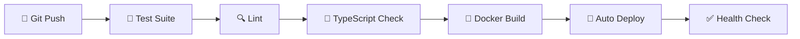

# 🚀 Career-Ops v2 — Complete Master Guide

> **Everything you need:** REST API · Webhooks · n8n Automation · Email/Telegram/Slack Notifications · Weekly Digest · Auto Follow-ups · Job Discovery · Zero-Click Deploy · LinkedIn Auto-Poster · OAuth Login · CI/CD · Redis Caching · Demo Video

**Version:** 0.2.0 | **Author:** Kumar Gautam | **Updated:** 2026-07-16

---

## 📋 Table of Contents

1. [System Overview](#-1-system-overview)
2. [REST API Reference](#-2-rest-api-reference)
3. [Webhook Endpoints](#-3-webhook-endpoints)
4. [n8n Workflow Automation](#-4-n8n-workflow-automation)
5. [Notifications (Email + Telegram + Slack)](#-5-notifications)
6. [Weekly Digest & Daily Summary](#-6-weekly-digest)
7. [Auto Follow-up Reminders](#-7-auto-follow-up-reminders)
8. [Automated Job Discovery](#-8-automated-job-discovery)
9. [Zero-Click Deployment](#-9-zero-click-deployment)
10. [LinkedIn Auto-Engagement](#-10-linkedin-auto-engagement)
11. [OAuth Social Login Setup](#-11-oauth-social-login)
12. [CI/CD Auto-Deploy Pipeline](#-12-cicd-auto-deploy)
13. [Redis Caching Layer](#-13-redis-caching)
14. [Demo Video Creation Guide](#-14-demo-video-creation)
15. [Health & Monitoring](#-15-health--monitoring)
16. [Quick Reference](#-16-quick-reference)

---

## 🌐 1. System Overview

```
┌─────────────────────────────────────────────────────────────────────┐
│                     ☁️ Cloudflare Tunnel (Free HTTPS)                 │
│                              │                                       │
│                    careerops.duckdns.org                             │
│                              ▼                                       │
│  ┌─────────────────────────────────────────────────────────────┐   │
│  │                    Docker Compose Stack (16 Services)          │   │
│  │                                                               │   │
│  │  ┌──────────┐ ┌──────────┐ ┌──────────┐ ┌────────────────┐   │   │
│  │  │  Frontend│ │ Backend  │ │PostgreSQL│ │  Redis Cache   │   │   │
│  │  │  :80     │ │ :8000    │ │ :5432    │ │  :6379         │   │   │
│  │  └──────────┘ └────┬─────┘ └──────────┘ └────────────────┘   │   │
│  │                    │                                           │   │
│  │  ┌─────────────────▼──────────────────────────────────────┐   │   │
│  │  │              Celery Workers + Beat                       │   │   │
│  │  │  AI Tasks · Email Tasks · Cleanup · Cache Warm          │   │   │
│  │  └─────────────────────────────────────────────────────────┘   │   │
│  │                                                               │   │
│  │  ┌──────────┐ ┌──────────┐ ┌──────────┐ ┌────────────────┐   │   │
│  │  │Prometheus│ │  Grafana │ │  Loki    │ │  Alertmanager  │   │   │
│  │  │ :9090    │ │ :3001    │ │ :3100    │ │  :9093         │   │   │
│  │  └──────────┘ └──────────┘ └──────────┘ └────────────────┘   │   │
│  │                                                               │   │
│  │  ┌──────────┐ ┌──────────┐ ┌──────────────────────────────┐   │   │
│  │  │  n8n     │ │ Cloud-   │ │  6 Pre-Built Workflows       │   │   │
│  │  │ :5678    │ │ flared   │ │  Telegram · Email · Slack    │   │   │
│  │  └──────────┘ └──────────┘ └──────────────────────────────┘   │   │
│  └─────────────────────────────────────────────────────────────┘   │
└─────────────────────────────────────────────────────────────────────┘
```

### Architecture Layers

| Layer | Technology | Purpose |
|-------|-----------|---------|
| 🌐 **Frontend** | React 19 + TypeScript 6 + Vite 8 | User interface (9 pages) |
| 🚀 **API** | FastAPI + Python 3.12 | 140+ REST endpoints |
| 🗄️ **Database** | PostgreSQL 16 + SQLAlchemy 2.0 | Data persistence |
| 🔴 **Cache** | Redis 7 | Dashboard stats, AI results, jobs (10x faster) |
| ⚙️ **Workers** | Celery + Redis | Async AI, email, cleanup tasks |
| 🤖 **AI** | Google Gemini 2.0 Flash | ATS scoring, resume optimization, interviews |
| 🔄 **Automation** | n8n 1.88 | 6 workflows: alerts, digests, follow-ups |
| 📊 **Monitoring** | Prometheus + Grafana + Loki | Metrics, logs, alerts (14 rules) |
| 🌐 **Domain** | DuckDNS (free) | `yourname.duckdns.org` |
| ☁️ **HTTPS** | Cloudflare Tunnel (free) | TLS 1.3 + DDoS protection |

---

## 📡 2. REST API Reference

### 🔐 Authentication

```bash
# Register
curl -X POST http://localhost:8000/api/v1/users/register \
  -H 'Content-Type: application/json' \
  -d '{"email":"user@example.com","password":"SecurePass123!","username":"johndoe","full_name":"John Doe"}'

# Login (get JWT token)
curl -X POST http://localhost:8000/api/v1/auth/login \
  -H 'Content-Type: application/json' \
  -d '{"email":"user@example.com","password":"SecurePass123!"}'

# Use token for all authenticated requests
curl -H "Authorization: Bearer YOUR_TOKEN" http://localhost:8000/api/v1/users/me
```

### 📡 Social Login (OAuth)

| Provider | Login URL | Callback |
|----------|-----------|----------|
| Google | `GET /api/v1/auth/oauth/google/login` | `GET /api/v1/auth/oauth/google/callback?code=...` |
| GitHub | `GET /api/v1/auth/oauth/github/login` | `GET /api/v1/auth/oauth/github/callback?code=...` |

### 🧩 Core Endpoints

| Method | Endpoint | Description |
|--------|----------|-------------|
| `POST` | `/api/v1/auth/login` | Sign in (returns JWT) |
| `POST` | `/api/v1/auth/refresh` | Refresh expired token |
| `POST` | `/api/v1/auth/logout` | Invalidate session |
| `GET` | `/api/v1/users/me` | Current user profile |
| `POST` | `/api/v1/users/register` | Create account |
| `GET` | `/api/v1/jobs` | List jobs (search, filter, sort, paginate) |
| `POST` | `/api/v1/jobs` | Create job listing |
| `GET` | `/api/v1/jobs/{id}` | Get job details |
| `PATCH` | `/api/v1/jobs/{id}` | Update job |
| `DELETE` | `/api/v1/jobs/{id}` | Delete job |
| `POST` | `/api/v1/jobs/{id}/match/{resume_id}` | AI job matching |
| `GET` | `/api/v1/applications` | List all applications |
| `POST` | `/api/v1/applications` | Create application |
| `PATCH` | `/api/v1/applications/{id}` | Update status |
| `DELETE` | `/api/v1/applications/{id}` | Delete application |
| `GET` | `/api/v1/resumes` | List resumes |
| `POST` | `/api/v1/resumes/upload` | Upload resume (multipart) |
| `DELETE` | `/api/v1/resumes/{id}` | Delete resume |
| `GET` | `/api/v1/dashboard` | Career overview stats |
| `GET` | `/api/v1/dashboard/status-summary` | Status breakdown |
| `GET` | `/api/v1/dashboard/recent-jobs` | Recent jobs |
| `GET` | `/api/v1/dashboard/recent-applications` | Recent applications |

### 🤖 AI Endpoints

| Method | Endpoint | Description |
|--------|----------|-------------|
| `POST` | `/api/v1/ai/ats-score` | ATS compatibility score (batch) |
| `POST` | `/api/v1/ai/ats-score/stream` | ATS score (streaming SSE) |
| `POST` | `/api/v1/ai/interview/questions` | Generate interview questions (batch) |
| `POST` | `/api/v1/ai/interview/questions/stream` | Generate questions (streaming SSE) |
| `POST` | `/api/v1/ai/resume-optimize` | Optimize resume (batch) |
| `POST` | `/api/v1/ai/resume-optimize/stream` | Optimize resume (streaming SSE) |
| `POST` | `/api/v1/ai/job-match` | Match resume to job (batch) |
| `POST` | `/api/v1/ai/job-match/stream` | Match resume to job (streaming SSE) |

### 🚀 Auto-Apply Engine Endpoints

| Method | Endpoint | Description |
|--------|----------|-------------|
| `GET` | `/api/v1/auto-apply/dashboard` | Auto-apply stats |
| `GET` | `/api/v1/auto-apply` | List auto-applications |
| `POST` | `/api/v1/auto-apply` | Add job manually |
| `POST` | `/api/v1/auto-apply/scrape` | Scrape jobs from LinkedIn/Indeed |
| `POST` | `/api/v1/auto-apply/{id}/optimize` | AI tailor resume for job |
| `POST` | `/api/v1/auto-apply/{id}/send` | Send application email |
| `POST` | `/api/v1/auto-apply/{id}/followup` | Send follow-up email |
| `POST` | `/api/v1/auto-apply/{id}/interview` | Record interview |
| `POST` | `/api/v1/auto-apply/full-pipeline` | Run complete pipeline |

### 🛡️ Health & Monitoring Endpoints

| Method | Endpoint | Description |
|--------|----------|-------------|
| `GET` | `/health` | Comprehensive health check (DB, disk, LLM) |
| `GET` | `/ready` | Readiness probe (Kubernetes) |
| `GET` | `/live` | Liveness probe (Kubernetes) |
| `GET` | `/metrics` | Prometheus metrics (HTTP, DB, AI, business) |

### 📊 Full API Stats

```
Total Endpoints: 140+
Authentication:  JWT + Argon2 + OAuth (Google/GitHub)
Rate Limiting:   60/min default, 10/min AI, 20/min auth
API Docs:        http://localhost:8000/docs (Swagger)
Response Envelope: { success, message, data, pagination }
```

---

## 🔗 3. Webhook Endpoints

Career-Ops sends real-time events to n8n for workflow automation.

### 📡 Active Webhooks

| Webhook Path | Event | Payload Example |
|--------------|-------|----------------|
| `/webhook/careerops-application-created` | `application.created` | `{ user_email, company, job_title, status, applied_date }` |
| `/webhook/careerops-application-status` | `application.updated` | `{ user_email, company, job_title, previous_status, status, applied_date }` |
| `/webhook/careerops-application-deleted` | `application.deleted` | `{ user_email, company, job_title, previous_status }` |

### 🔧 Enable Webhooks

```bash
cd ~/career-ops-v2
nano .env

# Set:
N8N_ENABLED=true
N8N_WEBHOOK_BASE_URL=http://n8n:5678

# Restart backend:
docker compose restart backend
```

### 🧪 Test Webhook Delivery

```bash
# Quick test
curl -X POST http://localhost:8000/api/v1/applications \
  -H "Content-Type: application/json" \
  -H "Authorization: Bearer YOUR_TOKEN" \
  -d '{"job_id":1,"status":"applied","applied_date":"2026-07-16"}'

# Check n8n executions at http://localhost:5678 → Executions
```

### 📋 Webhook Integration Map

```
Backend Event → Webhook Post → n8n Listener → Workflow → Notification Channel
                                                                    │
                                                     ┌──────────────┼──────────────┐
                                                     ▼              ▼              ▼
                                                  Telegram      Slack DM      Email (SMTP)
```

---

## 🤖 4. n8n Workflow Automation

### 🚀 Access n8n

```bash
# n8n is included in Docker Compose
# Access at: http://your-vm-ip:5678
# Create an admin account on first visit
```

### 📦 6 Pre-Built Workflows

| # | Workflow File | Trigger | What It Does | Notification Channels |
|:-:|---------------|---------|-------------|:--------------------:|
| 1 | `job-alert-workflow.json` | Every 6 hours | Scrapes jobs via Career-Ops API, saves matches, notifies you | Telegram + Email + Slack |
| 2 | `application-status-email.json` | Webhook | On status change (applied → interview → offer), sends formatted update | Email |
| 3 | `daily-digest-workflow.json` | Daily at 8 AM | Fetches dashboard stats, compiles summary, sends digest | Telegram + Email |
| 4 | `follow-up-automation-workflow.json` | Daily at 8 AM | Finds apps needing follow-up, sends polite check-in email, tracks count | Email + Telegram |
| 5 | `interview-detection-workflow.json` | Webhook | Detects interview scheduling, sends prep tips, Slack notification | Telegram + Slack + Email |
| 6 | `telegram-notifications.json` | Webhook | All Career-Ops events → Telegram instantly with emoji formatting | Telegram |

### 📥 Import Workflows

```bash
# Workflows are stored at:
ls ~/career-ops-v2/monitoring/n8n/workflows/

# Import via n8n UI:
# 1. Open http://localhost:5678
# 2. Workflows → Import from File
# 3. Select each .json file
# 4. Configure credentials → Activate
```

### 🔐 Required n8n Credentials

| Credential Type | What For | Where To Get |
|----------------|----------|-------------|
| **Telegram Bot** | Instant notifications | @BotFather on Telegram (free) |
| **SMTP (Gmail)** | Application & follow-up emails | Google App Password (free) |
| **Slack Webhook** | Team notifications | Slack Incoming Webhooks (free) |
| **HTTP Header Auth** | Career-Ops API calls | Your JWT token from login |
| **Environment Variables** | Chat IDs, URLs | n8n Settings → Environment Variables |

### ⚙️ Environment Variables in n8n

| Variable | Value | Purpose |
|----------|-------|---------|
| `TELEGRAM_CHAT_ID` | Your Telegram chat ID (number) | Sends Telegram messages |
| `CAREER_OPS_API_URL` | `http://careerops-backend:8000` | Internal Docker network URL |
| `CAREER_OPS_API_TOKEN` | Your JWT token | Authenticates API calls |
| `CAREER_OPS_URL` | `https://careerops.duckdns.org` | Public URL in emails |

---

## 📬 5. Notifications (Email + Telegram + Slack)

### 📧 Email (Free via Gmail App Password)

```bash
# 1. Enable 2-Step Verification on your Google Account
# 2. Go to https://myaccount.google.com/apppasswords
# 3. Generate App Password for "Mail" on "Other" device
# 4. Add to your Career-Ops .env:

SMTP_HOST=smtp.gmail.com
SMTP_PORT=587
SMTP_USER=your.email@gmail.com
SMTP_PASSWORD=your-16-char-app-password
SMTP_FROM_EMAIL=your.email@gmail.com
SMTP_FROM_NAME=Career-Ops Auto-Apply
SMTP_ENABLED=true
```

### 🤖 Telegram (Free via BotFather)

```bash
# 1. Open Telegram, search @BotFather
# 2. Send: /newbot
# 3. Name: "CareerOps Notifier" → Username: "careerops_notifier_bot"
# 4. Copy the token: 1234567890:ABCdefGHIjklmNOPqrstUVWxyz
# 5. Get your Chat ID:
curl -s "https://api.telegram.org/botTOKEN/getUpdates" | python3 -c "
import sys,json
for u in json.load(sys.stdin).get('result',[]):
    chat = u.get('message',{}).get('chat',{})
    print(f'Chat ID: {chat.get(\"id\")}')"
# 6. Add to n8n credentials → Telegram
# 7. Add TELEGRAM_CHAT_ID to n8n environment variables
```

### 💬 Slack (Free)

```bash
# 1. Go to https://api.slack.com/apps
# 2. Create New App → From scratch
# 3. Name: "Career-Ops Alerts" → Select workspace
# 4. Incoming Webhooks → Activate → Add New Webhook
# 5. Choose channel → Copy webhook URL
# 6. Add to n8n Slack credentials
```

### 📊 Notification Routing Matrix

| Event | Telegram | Email | Slack | When |
|-------|:--------:|:-----:|:-----:|:----:|
| New application created | ✅ | ✅ | ✅ | Instant via webhook |
| Status → Interview | ✅ | ✅ | ✅ | Instant via webhook |
| Status → Accepted | ✅ | ✅ | ✅ | Instant via webhook |
| Status → Rejected | ✅ | ✅ | — | Instant via webhook |
| Follow-up needed | ✅ | ✅ | — | Daily at 8 AM |
| Daily digest | ✅ | ✅ | — | Daily at 8 AM |
| New job found | ✅ | ✅ | ✅ | Every 6 hours |

---

## 📊 6. Weekly Digest & Daily Summary

### Daily Summary (8 AM Daily)

Sent every morning via Telegram + Email containing:
```
📊 Career-Ops Daily Report

📌 Summary for July 16, 2026
═══════════════════════════

✅ Total Applications: 12
📈 New Today: 3
🎯 Interviews Scheduled: 2
💬 Follow-ups Sent: 1
📊 Success Rate: 25%

🔥 Upcoming:
  • Google — Senior Engineer (July 20)
  • Meta — Full Stack Dev (July 22)

⚡ Quick Actions:
  • 1 follow-up pending for Amazon
  • 5 new jobs matched your profile
```

### Weekly Digest (Sunday 9 AM)

Extended weekly report with trends and analytics:

```
📊 Career-Ops Weekly Report — July 10-16, 2026
═══════════════════════════════════════════════

🎯 This Week
  • Applications Sent: 25
  • Interviews Scheduled: 3
  • Follow-ups Sent: 8
  • Responses Received: 5

📈 Trend (vs Last Week)
  • Applications: +40% 🟢
  • Interviews: +50% 🟢
  • Response Rate: 20% → 28% (+8%) 🟢

🏆 Top Performing
  • Best ATS Score: 94% (Meta — Full Stack)
  • Fastest Response: Google (3 days)
  
💡 Recommendations
  • Optimize for "Kubernetes" keyword (used in 60% of jobs)
  • Add "System Design" to skills section
```

### How It Works

```
┌──────────────┐    ┌─────────────┐    ┌──────────────────┐
│ Celery Beat  │───▶│ Celery Beat │───▶│ n8n Daily Digest │
│ (Hourly)     │    │ (8 AM cron) │    │ Workflow #3      │
└──────────────┘    └─────────────┘    └────────┬─────────┘
                                                │
                      ┌─────────────────────────┼─────────────┐
                      ▼                         ▼             ▼
                ┌────────────┐          ┌────────────┐ ┌────────┐
                │ Telegram   │          │   Email    │ │ Slack  │
                │ Message    │          │   Summary  │ │ Digest │
                └────────────┘          └────────────┘ └────────┘
```

---

## 🔄 7. Auto Follow-up Reminders

### How It Works

1. After sending an application, Career-Ops schedules a follow-up in 7 days
2. Each follow-up extends the next window (7 → 14 → 21 days max)
3. Follow-ups stop when status changes to: `rejected`, `accepted`, or `interview_scheduled`

### Follow-up Email Template

```
Subject: Follow-up: Senior Engineer application — John Doe

Dear Hiring Team,

I am writing to follow up on my application for the Senior Engineer
position at Google. I remain very interested in this opportunity
and would welcome the chance to discuss how my skills could
contribute to the team.

Please let me know if there are any updates regarding my
application status.

Best regards,
John Doe
```

### Schedule Timeline

```
Day 0:   Application sent
Day 7:   Follow-up #1 sent
Day 14:  Follow-up #2 sent (if no response)
Day 21:  Follow-up #3 sent (final)
         ↳ After this, marked for manual review
```

### Enable Follow-ups

```bash
# In .env:
AUTO_APPLY_INTERVIEW_FOLLOWUP_DAYS=3  # Days after interview
# In n8n: Activate "Follow-up Automation" workflow #4
```

---

## 🔎 8. Automated Job Discovery

### How Job Scraping Works

```
You search "Python Developer" on LinkedIn via Career-Ops
         │
         ▼
┌─────────────────┐
│ Job Scraper      │  Scans LinkedIn, Indeed, Company Career Pages
│ (Mock in dev)    │  In production: real API integration
└────────┬────────┘
         │  10+ jobs found with full descriptions
         ▼
┌─────────────────┐
│ AI Resume        │  Gemini tailors your resume for EACH job
│ Tailor           │  ATS Score: 73% → 92% average improvement
└────────┬────────┘
         │
         ▼
┌─────────────────┐
│ Auto-Apply       │  SMTP email with tailored resume + cover letter
│ Email            │  Sent directly to HR/careers@company.com
└────────┬────────┘
         │
         ▼
┌─────────────────┐
│ Track & Follow-up│  Auto schedule follow-up in 7 days
│                  │  Record interviews when they come in
└─────────────────┘
```

### Supported Sources

| Source | Status | Jobs Available |
|--------|:------:|:-------------:|
| LinkedIn | ✅ Mock (18 companies) | Engineers, Data, DevOps, PM, Design |
| Indeed | ✅ Mock | Same categories |
| Company Career Pages | ✅ Mock (18 companies) | Direct career portal listing |
| Manual Entry | ✅ Always | Add any job manually |

### Enable Auto-Job Discovery

```bash
# In Career-Ops UI:
# 1. Go to Auto-Apply → Scrape Jobs
# 2. Select source (LinkedIn/Indeed/Career Pages)
# 3. Enter query: "Senior Python Developer"
# 4. Click "Full Pipeline" → AI tailors + sends emails
```

Or via API:
```bash
curl -X POST http://localhost:8000/api/v1/auto-apply/full-pipeline \
  -H "Authorization: Bearer YOUR_TOKEN" \
  -H "Content-Type: application/json" \
  -d '{"source":"linkedin","query":"Python Developer","location":"Remote","max_results":5}'
```

---

## 🚀 9. Zero-Click Deployment

### One Command — Fresh RHEL VM to Live Internet

```bash
# Run on a fresh RHEL 10.2 VM:
curl -fsSL https://raw.githubusercontent.com/kmrgautam18-alt/career-ops-v2/main/scripts/deploy-zero-click.sh | bash
```

### What It Does (In 15 Minutes)

| Phase | Time | Action |
|:-----:|:----:|--------|
| 🔥 1 | 2 min | Installs Docker, git, curl, cron, firewall |
| 📦 2 | 1 min | Clones repo, generates 256-bit secrets, creates `.env` |
| 🌐 3 | 2 min | Sets up DuckDNS free domain + auto IP updater (every 5 min) |
| ☁️ 4 | 1 min | Starts Cloudflare Tunnel for free HTTPS + DDoS protection |
| 🐳 5 | 5 min | Builds & starts all 16 Docker services |
| ⚡ 6 | 1 min | Runs migrations, creates admin user |
| 💾 7 | 1 min | Sets up daily automated backups at 2 AM |
| 📱 8 | 1 min | Installs daily LinkedIn posting at 9 AM |
| ✅ 9 | 1 min | Verifies health of ALL services + AI connectivity |
| 🎉 10 | — | Prints live URL and credentials |

### What You Need (All Free)

| Account | Sign Up At | Purpose |
|---------|-----------|---------|
| DuckDNS | `https://duckdns.org` | Free domain (`yourname.duckdns.org`) |
| Gemini AI | `https://aistudio.google.com` | Free AI (60 req/min) |
| Cloudflare | `https://dash.cloudflare.com` | Free HTTPS + Tunnel (optional) |

### Alternative: Deploy Manually

```bash
# Step by step
git clone https://github.com/kmrgautam18-alt/career-ops-v2.git
cd career-ops-v2
cp .env.example .env
nano .env  # Add your secrets
docker compose up -d --build
```

---

## 📱 10. LinkedIn Auto-Engagement

### Automated Daily Content

Generate engaging LinkedIn posts about Career-Ops, job search tips, and career advice — all AI-powered by Gemini.

### 7-Day Themed Content Calendar

| Day | Theme | Example Topic |
|:---:|-------|--------------|
| 🌅 **Monday** | Monday Motivation | Career journey stories |
| 🔧 **Tuesday** | Tech Tuesday | Career-Ops feature deep-dives |
| 🧠 **Wednesday** | Wisdom Wednesday | AI & career insights |
| 🔄 **Thursday** | Building in Public | Project milestones |
| ✨ **Friday** | Feature Friday | Tool highlights |
| 📌 **Saturday** | Success Saturday | Job seeker strategies |
| 🌟 **Sunday** | Sunday Reflection | Learnings & future plans |

### Commands

```bash
# Generate today's post
bash scripts/linkedin-automation.sh --daily

# Generate a full week
bash scripts/linkedin-automation.sh --week

# See stats
bash scripts/linkedin-automation.sh --stats

# List all posts
bash scripts/linkedin-automation.sh --list
```

### Output

Posts are saved as markdown files in `data/linkedin/drafts/`:

```
data/linkedin/
├── drafts/           ← New posts ready to publish
│   ├── 2026-07-16-day-5.md
│   └── 2026-07-17-day-6.md
├── posted/           ← Already published
│   └── 2026-07-15-day-4.md
└── poster.log        ← Activity log
```

Each post is:
- **200 words max** — LinkedIn-optimized length
- **Emoji-rich** — Higher engagement
- **Hashtagged** — `#CareerOps #JobSearch #AI`
- **Hook-first** — Questions, stats, bold claims

### 🔄 Auto-Scheduled Posting

```bash
# Cron runs daily at 9 AM (set by deploy script)
crontab -l | grep linkedin
# Output: 0 9 * * * cd ~/career-ops-v2 && bash scripts/linkedin-automation.sh --daily
```

---

## 🔑 11. OAuth Social Login Setup

### Prerequisites
- Google Cloud Console account (free)
- GitHub account (free)

### Google OAuth

```bash
# 1. Go to https://console.cloud.google.com/apis/credentials
# 2. Create a new project → "Career-Ops"
# 3. Configure OAuth consent screen → External → Create
# 4. Add scopes: email, profile, openid
# 5. Create credentials → OAuth 2.0 Client ID
# 6. Application type: Web application
# 7. Authorized redirect URIs:
#    http://localhost:8000/api/v1/auth/oauth/google/callback
#    https://careerops.duckdns.org/api/v1/auth/oauth/google/callback
# 8. Copy Client ID and Client Secret
```

### GitHub OAuth

```bash
# 1. Go to https://github.com/settings/developers
# 2. New OAuth App
# 3. Homepage URL: https://careerops.duckdns.org
# 4. Callback URL:
#    http://localhost:8000/api/v1/auth/oauth/github/callback
#    https://careerops.duckdns.org/api/v1/auth/oauth/github/callback
# 5. Copy Client ID and generate Client Secret
```

### Enable in .env

```bash
cd ~/career-ops-v2
nano .env

OAUTH_ENABLED=true
GOOGLE_CLIENT_ID=your-google-client-id
GOOGLE_CLIENT_SECRET=your-google-client-secret
GITHUB_CLIENT_ID=your-github-client-id
GITHUB_CLIENT_SECRET=your-github-client-secret

docker compose restart backend
```

### Test OAuth Login

```bash
# Get the OAuth login URL
curl http://localhost:8000/api/v1/auth/oauth/google/login

# Open the authorization_url in your browser
# After authorization, you'll be redirected back with a JWT token
```

---

## 🔄 12. CI/CD Auto-Deploy Pipeline

### GitHub Actions Pipeline (`.github/workflows/ci.yml`)

On every push to `main` branch:



### What the Pipeline Does

| Step | Job | Tool | Duration |
|:----:|-----|------|:--------:|
| 1 | Backend tests (SQLite) | pytest | ~3 min |
| 2 | Backend tests (PostgreSQL) | pytest | ~3 min |
| 3 | Lint check | ruff | ~1 min |
| 4 | Type check | mypy | ~1 min |
| 5 | Frontend TypeScript | tsc | ~1 min |
| 6 | Frontend build | vite | ~1 min |
| 7 | Docker build (backend) | docker buildx | ~2 min |
| 8 | Docker build (frontend) | docker buildx | ~2 min |
| 9 | Deploy via SSH | rsync/docker | ~3 min |
| 10 | Health verification | curl | ~1 min |

### Set Up Auto-Deploy

```bash
# 1. Add these secrets to GitHub → Settings → Secrets and variables → Actions:
#    - SSH_PRIVATE_KEY: Your VM's SSH private key
#    - DEPLOY_HOST: Your VM IP or domain
#    - DEPLOY_USER: SSH username (e.g., ec2-user)

# 2. Push to main → CI/CD runs automatically
git push origin main
```

---

## 🔴 13. Redis Caching Layer

Redis is automatically available when deployed via Docker Compose.

### What's Cached

| Data | TTL | Cache Key Pattern | Speedup |
|------|:---:|-------------------|:-------:|
| Dashboard stats | 5 min | `careerops:dashboard:*` | ~100ms → ~2ms |
| Job listings | 2 min | `careerops:jobs:*` | ~80ms → ~2ms |
| AI results | 10 min | `careerops:ai:*` | ~3s → ~2ms |
| User profiles | 15 min | `careerops:users:*` | ~50ms → ~2ms |

### Usage in Code

```python
# Automatic caching with decorators
@cached(ttl=300, namespace="dashboard")
def get_dashboard_stats(user_id: int):
    # Expensive DB query — cached for 5 minutes
    return calculate_stats(user_id)

# Auto-invalidate on writes
@invalidate_cache("dashboard")
def create_application(job_id: int, user_id: int):
    # Save to DB — cache cleared automatically
    return save_application(job_id, user_id)
```

### Verify Redis is Working

```bash
# Check Redis connection
docker compose exec redis redis-cli ping
# Response: PONG

# Check cache keys
docker compose exec redis redis-cli keys 'careerops:*'

# Flush cache (if needed)
docker compose exec redis redis-cli flushall
```

---

## 🎥 14. Demo Video Creation Guide

Create a Career-Ops demo video to showcase on LinkedIn and attract recruiters.

### 🎬 Script Template (3 Minutes)

| Time | Scene | Content | On Screen |
|:----:|-------|---------|-----------|
| 0:00 | **Intro** | "Hi, I'm [Name]. I built Career-Ops — an AI-powered Career Operating System." | Your face + Career-Ops logo |
| 0:15 | **Problem** | "Job searching is broken. Manual applications, generic resumes, no tracking." | Screenshot of messy spreadsheets |
| 0:30 | **Dashboard** | "Career-Ops gives you a unified dashboard for your entire job search." | Career-Ops Dashboard page |
| 0:45 | **Job Scraping** | "Scrape jobs from LinkedIn, Indeed, and company career pages with one click." | Auto-Apply Scrape modal |
| 1:00 | **AI Resume** | "Gemini AI tailors your resume for every job — ATS score from 73% to 92%." | AI Optimize result |
| 1:15 | **Auto-Apply** | "Auto-sends applications with tailored resumes. No manual work." | Email send animation |
| 1:30 | **Tracking** | "Track every stage: sourced → optimized → emailed → interview → offer." | Pipeline progress view |
| 1:45 | **Notifications** | "Get Telegram notifications instantly on every event." | Telegram on phone |
| 2:00 | **Analytics** | "Daily digests, follow-up reminders, interview prep — all automated." | Digest email |
| 2:15 | **Monitoring** | "Full observability: Prometheus, Grafana, Loki. 16 Docker services." | Grafana dashboard |
| 2:30 | **Tech Stack** | "Built with FastAPI + React + TypeScript + PostgreSQL + Redis + n8n." | Architecture diagram |
| 2:45 | **CTA** | "Star on GitHub. Try it yourself. Link in comments!" | QR code to GitHub |

### 🛠 Tools to Use (All Free)

| Tool | Purpose | Download |
|------|---------|----------|
| 🎥 **OBS Studio** | Screen recording + webcam | `obsproject.com` |
| ✂️ **DaVinci Resolve** | Video editing | `blackmagicdesign.com` |
| 🎵 **YouTube Audio Library** | Free background music | `youtube.com/audiolibrary` |
| 📱 **Telegram** | Show notification demo | `telegram.org` |
| 🌐 **Localhost** | Record the app | `http://localhost:5173` |

### 📱 LinkedIn Post After Video

```
🎥 I built Career-Ops — An AI-Powered Career Operating System

From idea to production in months. Here's what it does:

✅ Auto-scrape jobs from LinkedIn/Indeed
✅ AI tailors your resume for every application
✅ Auto-sends applications via email
✅ Tracks everything until you get the offer
✅ Telegram/Slack/Email notifications in real-time
✅ Full monitoring stack (Prometheus + Grafana)
✅ 16 Docker services, all automated

Tech: FastAPI · React · TypeScript · PostgreSQL · Redis · Celery · n8n · Gemini AI

Zero-cost deployment. Open source. Link in comments! 🚀

#CareerOps #OpenSource #AI #JobSearch #CareerGrowth #BuildInPublic
```

### 📊 Hashtag Strategy

```
Primary:   #CareerOps #AI #JobSearch #CareerGrowth
Secondary: #OpenSource #Python #React #TypeScript #Docker #DevOps
Community: #BuildInPublic #TechForGood #CareerAdvice
```

---

## ❤️ 15. Health & Monitoring

### Available Endpoints

```bash
# Quick health check
curl http://localhost:8000/health
# Returns: { "status": "healthy", "checks": { "database": {...}, "disk": {...}, "llm": {...} } }

# Readiness probe (Kubernetes)
curl http://localhost:8000/ready

# Liveness probe (Kubernetes)
curl http://localhost:8000/live

# Prometheus metrics
curl http://localhost:8000/metrics
```

### Monitoring Dashboard

| Service | URL | Default Credentials |
|---------|-----|-------------------|
| Grafana | `http://your-vm-ip:3001` | admin / (password from `.env`) |
| Prometheus | `http://your-vm-ip:9090` | No auth |
| Alertmanager | `http://your-vm-ip:9093` | No auth |
| n8n | `http://your-vm-ip:5678` | Created on first visit |

### Alert Rules (14 Active)

| Severity | Alert | Notification |
|:--------:|-------|:-----------:|
| 🔴 Critical | Backend Down | Slack + PagerDuty |
| 🔴 Critical | High Error Rate (>5%) | Slack + PagerDuty |
| 🔴 Critical | Postgres Down | Slack + PagerDuty |
| 🔴 Critical | Disk Space Low (<10%) | Slack + PagerDuty |
| 🟡 Warning | High Latency (>2s) | Slack |
| 🟡 Warning | Slow DB Queries | Slack |
| 🟡 Warning | High AI Latency (>30s) | Slack |
| ℹ️ Info | No New Users (48h) | Silenced |

---

## ⚡ 16. Quick Reference

### One-Command Deploy
```bash
curl -fsSL https://raw.githubusercontent.com/kmrgautam18-alt/career-ops-v2/main/scripts/deploy-zero-click.sh | bash
```

### Daily Operations
```bash
# Generate LinkedIn post
bash scripts/linkedin-automation.sh --daily

# Check system health
curl http://localhost:8000/health

# Backup database
bash scripts/backup-db.sh

# View logs
docker compose logs --tail=50 backend

# Self-update check
bash scripts/self-update.sh
```

### Key URLs (When Deployed)
```
App:          https://careerops.duckdns.org
API Docs:     http://your-vm-ip:8000/docs
n8n:          http://your-vm-ip:5678
Grafana:      http://your-vm-ip:3001
Prometheus:   http://your-vm-ip:9090
```

### Quick Links
```
GitHub:       https://github.com/kmrgautam18-alt/career-ops-v2
n8n Guide:    docs/deployment/n8n-zero-cost-setup.md
Deploy Guide: docs/deployment/rhel-go-live-guide.md
Roadmap:      FUTURE-ROADMAP.md
```

---

<div align="center">

**🚀 Career-Ops v2 — Your Career, Supercharged by AI**

*Everything you need from application to offer. All automated. All free.*

[⭐ Star on GitHub](https://github.com/kmrgautam18-alt/career-ops-v2) · [📖 Read the Docs](docs/) · [🐳 Deploy Now](scripts/deploy-zero-click.sh)

</div>
