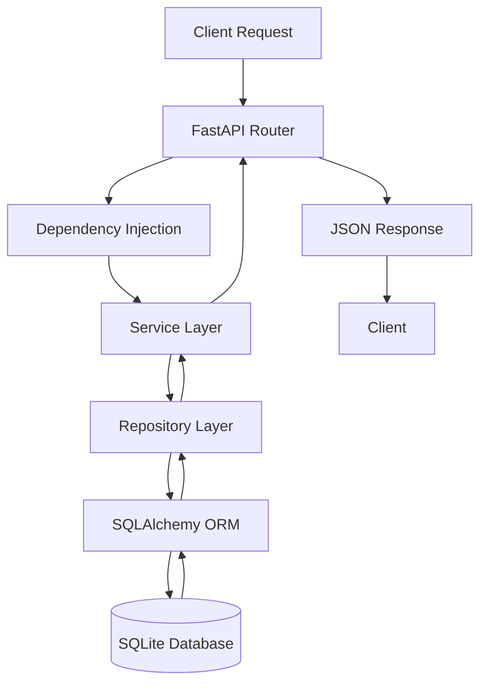

# Backend Architecture

| Field           | Value                |
| --------------- | -------------------- |
| Document        | Backend Architecture |
| Version         | 1.0                  |
| Status          | Draft                |
| Project Version | v0.2.0               |
| Last Updated    | 2026-06-27           |
| Owner           | KUMAR GAUTAM         |

---

# Purpose

This document describes the internal backend architecture of Career-Ops v2.

It explains how requests travel through the backend application, how responsibilities are separated across different layers, and why this architecture was chosen.

The backend follows a layered architecture with clear separation of concerns to improve maintainability, scalability, and testability.

---

# Backend Request Flow

Every client request follows the same execution path inside the backend application.

```text
Client
    │
    ▼
FastAPI Router
    │
    ▼
Dependency Injection
    │
    ▼
Service Layer
    │
    ▼
Repository Layer
    │
    ▼
SQLAlchemy ORM
    │
    ▼
SQLite Database
```

The response follows the reverse path and is returned to the client as a JSON response.

---

# Backend Request Flow Diagram



---

# Backend Layers

## 1. FastAPI Router

**Responsibility**

* Receives HTTP requests
* Validates request data
* Calls the Service Layer
* Returns JSON responses

---

## 2. Dependency Injection

**Responsibility**

* Creates database sessions
* Manages session lifecycle
* Closes sessions automatically

---

## 3. Service Layer

**Responsibility**

* Contains business logic
* Validates business rules
* Coordinates repositories
* Returns processed data

---

## 4. Repository Layer

**Responsibility**

* Handles database operations
* Executes CRUD operations
* Isolates SQLAlchemy from business logic

---

## 5. SQLAlchemy ORM

**Responsibility**

* Maps Python models to database tables
* Generates SQL queries
* Manages object persistence

---

## 6. Database

**Current Database**

* SQLite

**Future Database**

* PostgreSQL

