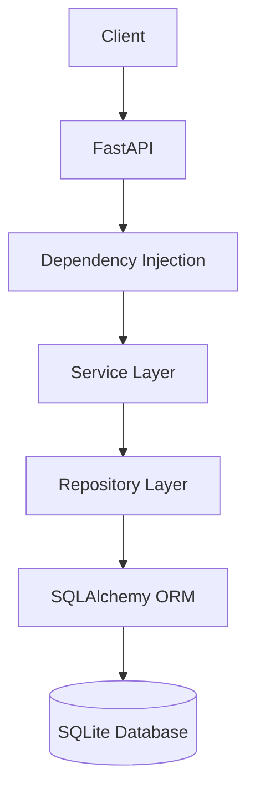

# System Architecture

| Field | Value |
|-------|-------|
| Document | System Architecture |
| Version | 1.0 |
| Status | Draft |
| Project Version | v0.2.0 |
| Last Updated | 2026-06-27 |
| Owner | KUMAR GAUTAM |

---

# Purpose

This document describes the overall system architecture of Career-Ops v2, including the current implementation and the planned production architecture.

---

# Current Architecture

Career-Ops v2 currently follows a layered backend architecture.

The request flow is:

```text
Client
    │
    ▼
FastAPI
    │
    ▼
Dependency Injection
    │
    ▼
Service Layer
    │
    ▼
Repository Layer
    │
    ▼
SQLAlchemy ORM
    │
    ▼
SQLite Database
```

---

# Current Components

- FastAPI REST API
- SQLAlchemy ORM
- SQLite Database
- Repository Pattern
- Service Layer
- Dependency Injection
- Pydantic Validation
- Centralized Exception Handling
- Configuration Management
- Logging

---

# Current Architecture Diagram



---

# Notes

This diagram represents the current implementation of Career-Ops v2 as of version **v0.2.0**.

Future architecture enhancements such as PostgreSQL, Redis, AI Engine, Monitoring, Docker, Kubernetes, and n8n Automation will be documented separately under the **Target Architecture** section in future revisions.

---

# Related Documents

- Project Vision
- Backend Architecture *(Planned)*
- Database Schema *(Planned)*
- API Documentation *(Planned)*

---

# Version History

| Version | Date | Description |
|----------|------------|------------------------------|
| 1.0 | 2026-06-27 | Initial System Architecture |
