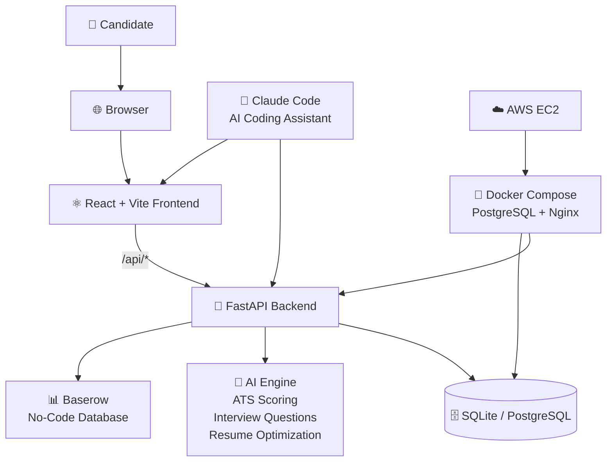

# System Context Diagram

Version: 2.0

Status: Active

---

# Purpose

This diagram shows the highest-level view of Career-Ops v2 and its interaction with external users and systems.

---

## System Context

---

# External Actors

## Candidate

- Manages job opportunities
- Uploads and manages resumes
- Tracks applications and interviews
- Uses AI tools for career optimization

---

## External Systems

### AI Engine (Built-in)

Responsible for:

- ATS Score Calculation
- Interview Question Generation
- Resume Optimization
- Job Matching

### Baserow (No-Code Database)

Responsible for:

- Collaborative data management
- External spreadsheet-like database
- Optional data sync and admin views

### Claude Code (AI Assistant)

Responsible for:

- AI-powered code editing and debugging
- Project context via CLAUDE.md
- Git workflow assistance

---

# Deployment

## Docker Compose

The full stack is containerized:

- **PostgreSQL 16** — Production database
- **FastAPI Backend** — Python REST API
- **Nginx** — Serves frontend build + reverse proxies API

## AWS EC2

Automated deployment via:

- `scripts/ec2-bootstrap.sh` — One-time instance setup
- `scripts/deploy-ec2.sh` — Continuous deployment from local machine

---

# Goal

Career-Ops v2 acts as the central platform connecting users, AI services, databases, and external tools into one integrated career management ecosystem.
