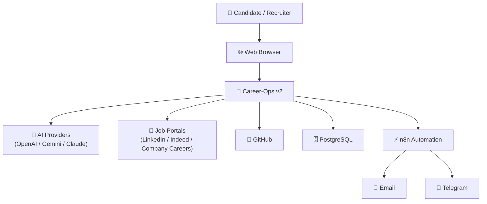

# System Context Diagram

Version: 1.0

Status: Active

---

# Purpose

This diagram shows the highest-level view of Career-Ops v2 and its interaction with external users and systems.

---

## System Context

---

# External Actors

## Candidate

- Searches jobs
- Uploads resumes
- Tracks applications
- Receives interview preparation

---

## Recruiter

- Reviews candidate profiles
- Searches applicants
- Views analytics

---

## External Systems

### AI Providers

Responsible for:

- Resume Optimization
- ATS Analysis
- Job Matching
- Interview Coaching

---

### Job Portals

Responsible for:

- Job Discovery
- Job Import
- Future Auto Apply

---

### GitHub

Responsible for:

- Source Code
- CI/CD
- Version Control

---

### n8n

Responsible for:

- Workflow Automation
- Notifications
- Scheduled Jobs

---

# Goal

Career-Ops v2 acts as the central platform connecting users, AI providers, automation services, databases, and external job portals into one integrated career management ecosystem.