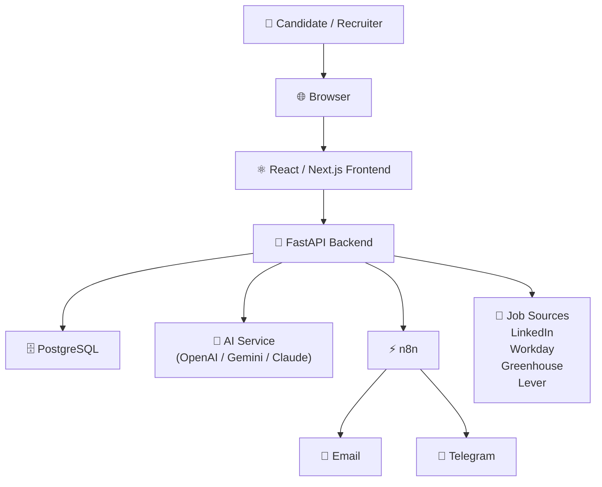

# Container Diagram

Version: 1.0

Status: Active

---

# Purpose

This diagram describes the major deployable containers that make up the Career-Ops v2 platform and how they communicate.

---

# Container Diagram

---

# Containers

## React / Next.js

Responsibilities

- Authentication UI
- Dashboard
- Resume Upload
- Job Search
- Analytics

Technology

- React
- Next.js
- TailwindCSS

---

## FastAPI Backend

Responsibilities

- REST APIs
- Authentication
- Business Logic
- AI Integration
- Automation APIs

Technology

- FastAPI
- SQLAlchemy
- Pydantic

---

## PostgreSQL

Responsibilities

- User Data
- Jobs
- Applications
- Resumes
- Audit Logs

---

## AI Service

Responsibilities

- Resume Analysis
- ATS Scoring
- Resume Optimization
- Job Matching
- Interview Coach

Supported Providers

- OpenAI
- Gemini
- Claude
- Local Models (Future)

---

## n8n

Responsibilities

- Job Alerts
- Scheduled Workflows
- Email Automation
- Telegram Notifications
- Future Auto Apply

---

## Job Sources

Responsibilities

- Job Discovery
- Job Import
- Company Career Pages
- ATS Platforms

Examples

- LinkedIn
- Workday
- Greenhouse
- Lever

---

# Communication Flow

Candidate

↓

Browser

↓

Frontend

↓

Backend

↓

Database

↓

AI

↓

Automation

↓

Notifications

---

# Design Principles

- Frontend never talks directly to Database.
- Frontend never talks directly to AI Providers.
- Backend owns all business logic.
- Database is only accessed through Repository Layer.
- Automation runs independently through n8n.
- AI providers can be replaced without affecting the frontend.