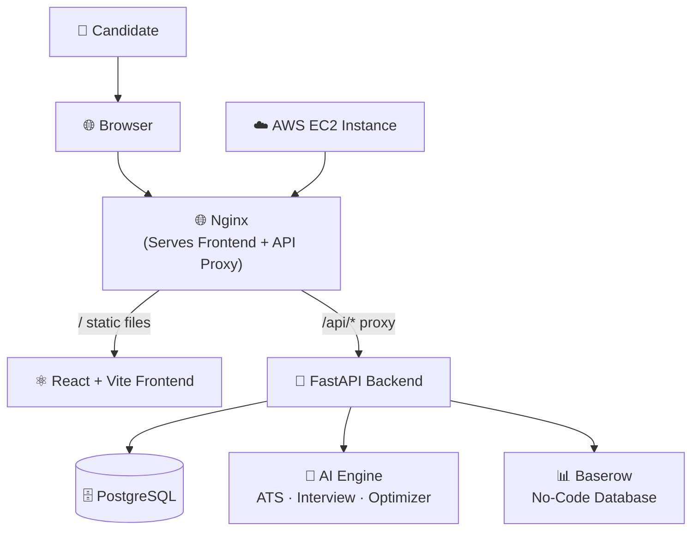

# Container Diagram

Version: 2.0

Status: Active

---

# Purpose

This diagram describes the major deployable containers that make up the Career-Ops v2 platform and how they communicate.

---

# Container Diagram



---

# Containers

## Nginx

Responsibilities

- Serve built frontend static files
- Reverse-proxy `/api/*` to the backend
- Gzip compression, asset caching
- SPA fallback routing

---

## React + Vite Frontend

Responsibilities

- Authentication UI (Login, Register)
- Dashboard with career metrics
- Job management CRUD
- Application tracking
- Resume upload and management
- AI tools (ATS scoring, interview questions)

Technology

- React 19, TypeScript 6, Vite 8
- Tailwind CSS 4, Framer Motion
- React Router, Recharts, Axios

---

## FastAPI Backend

Responsibilities

- REST API (134+ endpoints, 10 modules)
- JWT Authentication (access + refresh tokens)
- Business logic for all features
- AI service integration
- Baserow API integration

Technology

- Python 3.12, FastAPI
- SQLAlchemy 2.0, Pydantic 2
- Argon2 password hashing
- python-jose (JWT)

---

## PostgreSQL

Responsibilities

- User accounts and profiles
- Job opportunities
- Applications with status tracking
- Resumes and parsed data
- Education, experience, skills, profiles

---

## AI Engine (Built-in)

Modules

- **ATS Scoring** — Analyze resume against job description
- **Interview Questions** — Generate role-specific practice questions
- **Resume Optimization** — Suggestions to improve resume
- **Job Matching** — Match resume to job requirements

---

## Baserow

Responsibilities

- External no-code database for collaborative data
- Optional admin/spreadsheet interface for career data
- API-driven CRUD operations

---

## AWS EC2

Deployment target running:

- Docker Compose with PostgreSQL 16
- FastAPI backend (uvicorn)
- Nginx serving frontend

---

# Communication Flow

```
Browser
   ↓
Nginx (port 80)
   ├── / → Frontend static files
   └── /api/* → FastAPI Backend (port 8000)
                  ├── PostgreSQL
                  ├── AI Engine
                  └── Baserow API
```

---

# Design Principles

- Nginx is the single entry point (port 80)
- Backend never exposed directly to the internet
- Frontend never talks directly to database
- Backend owns all business logic
- All API responses use standard `ApiResponse` envelope
