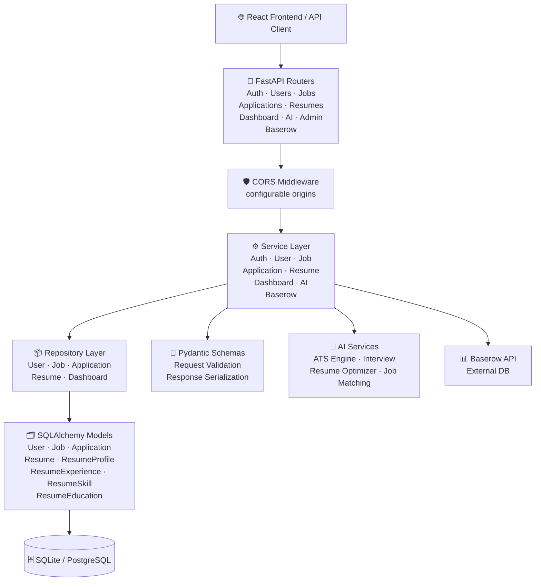

# Component Diagram

Version: 2.0

Status: Active

---

# Purpose

This diagram describes the internal components of the Career-Ops v2 backend and how they interact.

---

# Component Diagram

---

# Components

## FastAPI Routers (10 modules)

| Router | Endpoints |
|--------|-----------|
| Auth | `/auth/login`, `/auth/refresh`, `/auth/logout` |
| Users | `/users/register`, `/users/me`, `/users/{id}` |
| Jobs | `/jobs` CRUD, `/jobs/{id}/match/{resume_id}` |
| Applications | `/applications` CRUD |
| Resumes | `/resumes` CRUD, upload, download, preview |
| Dashboard | `/dashboard/` stats, recent, status-summary |
| Admin | `/admin/health` |
| AI | `/ai/ats-score`, `/ai/interview/questions`, `/ai/resume-optimize` |
| Baserow | `/baserow/tables`, rows CRUD, health |

---

## CORS Middleware

- Configurable via `CORS_ORIGINS` env var
- Allows comma-separated origins (dev: localhost:5173, prod: yourdomain.com)
- Supports credentials (cookies, auth headers)

---

## Service Layer

Modules

- **AuthService** — Login, token creation, password verification
- **UserService** — Registration, profile management
- **JobService** — Job CRUD, search, filtering, pagination
- **ApplicationService** — Application tracking, status management
- **ResumeService** — Upload, validation, file storage, metadata
- **DashboardService** — Aggregated stats, recent activity
- **AIService** — ATS scoring, interview generation, optimization
- **BaserowService** — External no-code database client

---

## Repository Layer

- Implements the Repository pattern for database abstraction
- Each entity has a dedicated repository
- Handles CRUD, search, filtering, pagination
- Isolates SQLAlchemy from business logic

---

## SQLAlchemy Models (8 tables)

| Table | Purpose |
|-------|---------|
| `users` | Accounts, auth, roles |
| `jobs` | Job opportunities |
| `applications` | Application tracking |
| `resumes` | Resume metadata and file storage |
| `resume_profiles` | Parsed profile data |
| `resume_experiences` | Work history from resumes |
| `resume_skills` | Extracted skills |
| `resume_educations` | Education history |

---

## AI Services

| Service | Description |
|---------|-------------|
| ATSEngine | Analyze resume vs job description |
| InterviewGenerator | Create role-specific practice questions |
| ResumeOptimizer | Suggest improvements to resume content |
| JobMatcher | Score resume against job requirements |

---

## Baserow Service

- REST API client for Baserow
- Methods: list_tables, list_rows, get/create/update/delete row
- Configurable via `BASEROW_URL` and `BASEROW_TOKEN`

---

# Design Rules

- Routers never access the database directly
- Services own all business logic
- Repositories never contain business logic
- Models only define persistence
- Schemas only define API contracts
- Middleware remains reusable and independent
- AI providers can be swapped without affecting other layers
