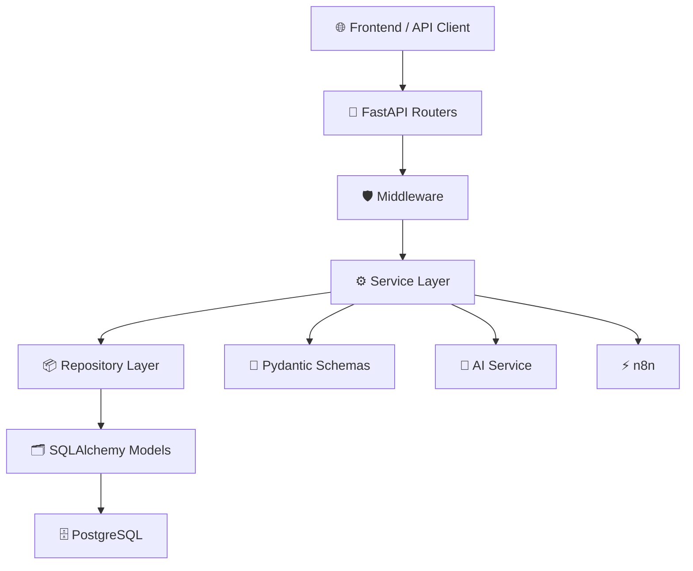

# Component Diagram

Version: 1.0

Status: Active

---

# Purpose

This diagram describes the internal components of the Career-Ops v2 backend and how they interact.

---

# Component Diagram

---

# Components

## FastAPI Routers

Responsibilities

- HTTP Endpoints
- Request Validation
- Response Handling
- API Versioning

---

## Middleware

Responsibilities

- Logging
- Authentication
- Authorization
- Rate Limiting
- Request ID
- Exception Handling

---

## Service Layer

Responsibilities

- Business Logic
- Validation
- AI Integration
- Automation Triggers

---

## Repository Layer

Responsibilities

- Database Operations
- Query Construction
- Pagination
- Search
- Filtering

---

## SQLAlchemy Models

Responsibilities

- Database Mapping
- Relationships
- Constraints

---

## Pydantic Schemas

Responsibilities

- Request Validation
- Response Serialization
- Type Safety

---

## AI Service

Responsibilities

- Resume Analysis
- ATS Score
- Job Matching
- Interview Coach

---

## n8n

Responsibilities

- Email
- Telegram
- Scheduled Jobs
- Workflow Automation

---

# Component Flow

Client

↓

Router

↓

Middleware

↓

Service

↓

Repository

↓

Models

↓

Database

---

# Design Rules

- Routers never access the database directly.
- Services own all business logic.
- Repositories never contain business logic.
- Models only define persistence.
- Schemas only define API contracts.
- Middleware remains reusable and independent.