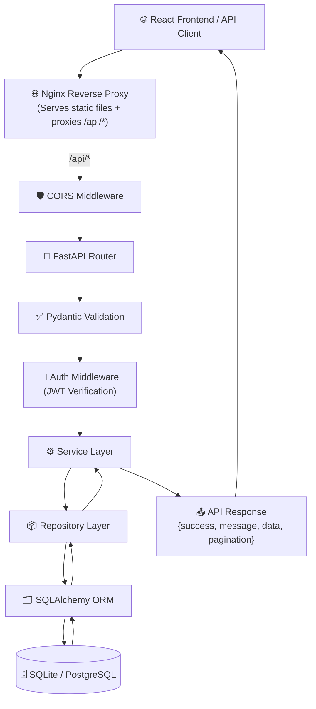
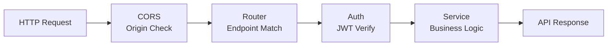

# Backend Request Flow

Version: 2.0

Status: Active

---

# Purpose

This diagram illustrates the lifecycle of an HTTP request inside the Career-Ops v2 backend.

---

# Backend Request Flow



---

# Request Lifecycle

1. **Client** sends HTTP request to Nginx (port 80/5173)
2. **Nginx** proxies `/api/*` requests to FastAPI (port 8000)
3. **CORS Middleware** validates the origin against `CORS_ORIGINS`
4. **FastAPI Router** matches the endpoint
5. **Pydantic** validates request body and query parameters
6. **Auth Middleware** extracts and verifies JWT token (unless public)
7. **Service Layer** executes business logic (may call AI, Baserow)
8. **Repository** performs database operations
9. **SQLAlchemy ORM** executes queries against database
10. **Response** is serialized via Pydantic schemas into `ApiResponse` envelope

---

# Middleware Pipeline



---

# Data Flow for Authenticated Requests

```
Request
  ↓
Nginx → /api/v1/jobs (with Authorization: Bearer <token>)
  ↓
CORS Middleware → validates origin
  ↓
FastAPI Router → matches GET /api/v1/jobs
  ↓
Auth Middleware → decodes JWT → gets current_user
  ↓
Service Layer → list_jobs(current_user, filters, pagination)
  ↓
Repository → query database with filters
  ↓
SQLAlchemy → SELECT ... FROM jobs WHERE user_id = ?
  ↓
Response → { success, data: [...], pagination: {...} }
```

---

# Responsibilities

| Layer | Responsibility |
|-------|---------------|
| Nginx | Reverse proxy, static files, caching |
| CORS | Origin validation, credential support |
| Router | Endpoint mapping, dependency injection |
| Validation | Request validation, type checking |
| Auth | JWT verification, user extraction |
| Service | Business rules, AI/Baserow integration |
| Repository | CRUD, search, filtering, pagination |
| ORM | Object mapping, transactions, relationships |
| Database | Persistent storage |

---

# Design Principles

- Validation before business logic
- Business logic before database access
- Repository abstracts persistence
- API responses remain standardized (`ApiResponse`)
- Every request follows the same lifecycle
- Nginx is the single entry point in production
