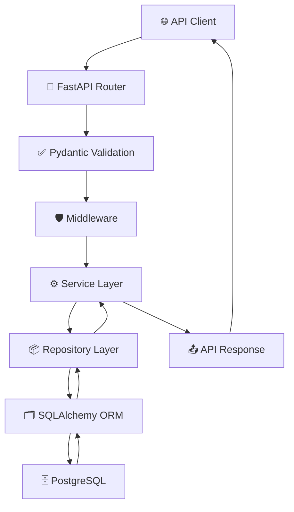

# Backend Request Flow

Version: 1.0

Status: Active

---

# Purpose

This diagram illustrates the lifecycle of an HTTP request inside the Career-Ops v2 backend.

---

# Backend Request Flow

---

# Request Lifecycle

1. Client sends an HTTP request.

2. FastAPI Router receives the request.

3. Pydantic validates the request body.

4. Middleware executes.

5. Business logic runs inside the Service Layer.

6. Repository executes database queries.

7. SQLAlchemy communicates with PostgreSQL.

8. Results are returned back to the Service Layer.

9. Response schemas serialize the output.

10. Standard API response is returned.

---

# Responsibilities

## Router

- Endpoint Mapping
- Dependency Injection

---

## Validation

- Request Validation
- Type Checking
- Data Sanitization

---

## Middleware

- Logging
- Authentication
- Rate Limiting
- Error Handling

---

## Service

- Business Rules
- AI Integration
- Workflow Execution

---

## Repository

- CRUD
- Search
- Filtering
- Pagination

---

## ORM

- Object Mapping
- Transactions
- Relationships

---

## Database

- Persistent Storage

---

# Design Principles

- Validation before business logic.
- Business logic before database access.
- Repository abstracts persistence.
- API responses remain standardized.
- Every request follows the same lifecycle.