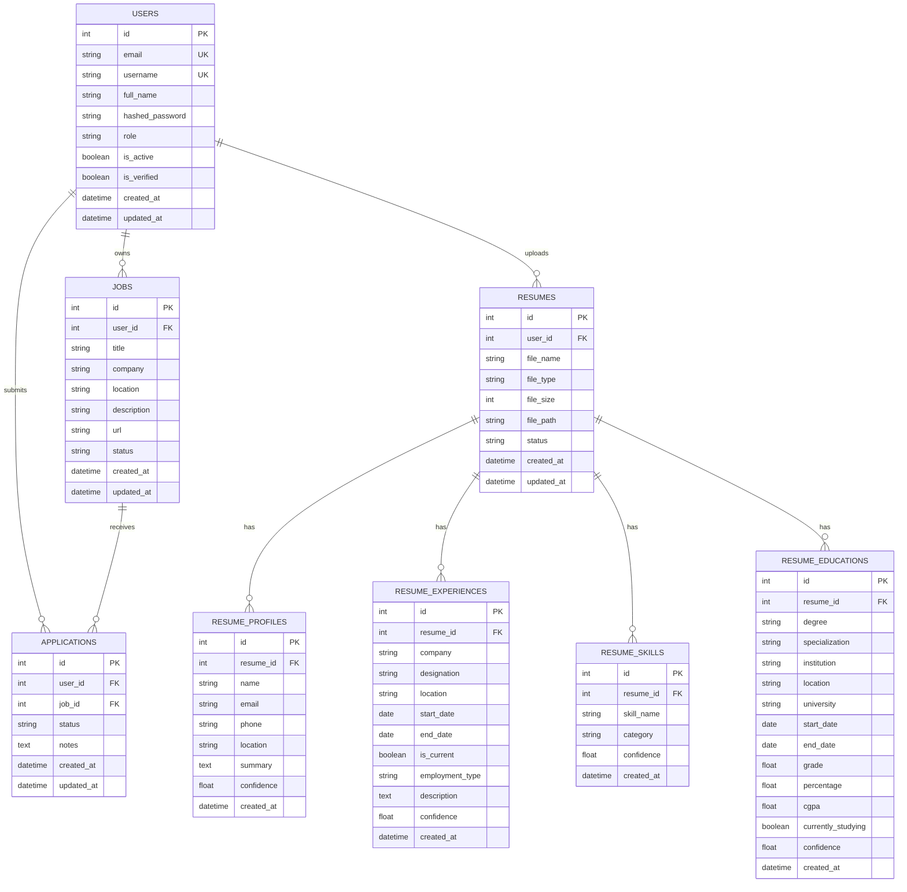

# Database ER Diagram

Version: 2.0

Status: Active

---

# Purpose

This document describes the actual database model for Career-Ops v2 as implemented.

The database contains **8 tables** covering users, jobs, applications, and resume data.

---

# Entity Relationship Diagram



---

# Table Relationships

```
users
 ├──< jobs          (one user has many jobs)
 ├──< applications  (one user has many applications)
 └──< resumes       (one user has many resumes)

jobs
 └──< applications  (one job can have many applications)

resumes
 ├──< resume_profiles      (one resume has one profile)
 ├──< resume_experiences   (one resume has many experiences)
 ├──< resume_skills        (one resume has many skills)
 └──< resume_educations    (one resume has many educations)
```

---

# Key Design Decisions

| Decision | Implementation |
|----------|---------------|
| Primary keys | Auto-increment integers (UUID planned for future) |
| Foreign keys | Cascading deletes (CASCADE on resume child tables) |
| Timestamps | All tables have `created_at`, most have `updated_at` |
| Soft deletes | Not yet implemented (planned) |
| Indexed columns | `email`, `username`, `user_id`, `resume_id`, `job_id` |
| Search columns | `title`, `company`, `status`, `degree` are indexed |

---

# Migration Management

- Managed via **Alembic** with versioned migration scripts
- Current schema version: 7 migrations applied
- Supports both SQLite (dev) and PostgreSQL (prod)
- Migrations located in `alembic/versions/`

---

# Design Principles

- Normalized schema with foreign key constraints
- All user data is scoped by `user_id`
- Resume data is decomposed into structured entities (profile, experience, skill, education)
- AI-ready schema — confidence scores stored alongside extracted data
- Future: UUID primary keys, soft deletes, audit logging
