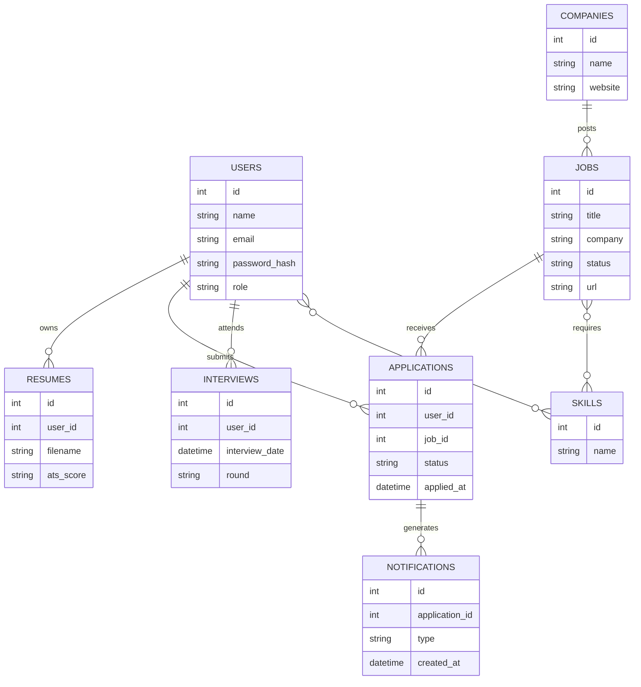

# Database ER Diagram

Version: 1.0

Status: Active

---

# Purpose

This document describes the logical database model for Career-Ops v2.

The current implementation contains only a subset of these tables. Additional entities will be introduced as future phases are completed.

---

# Entity Relationship Diagram

---

# Core Entities

## Users

Stores candidate accounts.

---

## Companies

Stores employer information.

---

## Jobs

Stores available job postings.

---

## Applications

Tracks every submitted application.

---

## Resumes

Stores uploaded resumes and future ATS scores.

---

## Skills

Used for AI-based skill matching.

---

## Interviews

Stores interview schedule and progress.

---

## Notifications

Generated by automation workflows.

---

# Database Design Principles

- Normalized schema
- UUID support in future
- Soft delete support (future)
- Audit logging (future)
- Foreign key constraints
- Indexed search columns
- AI-ready schema