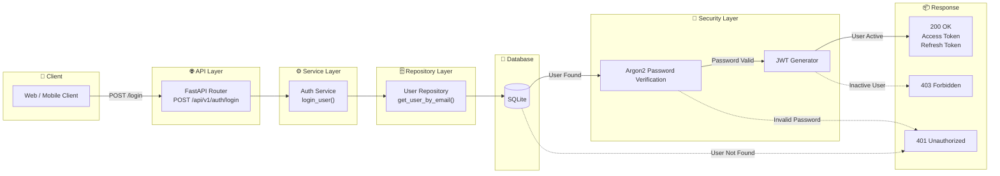
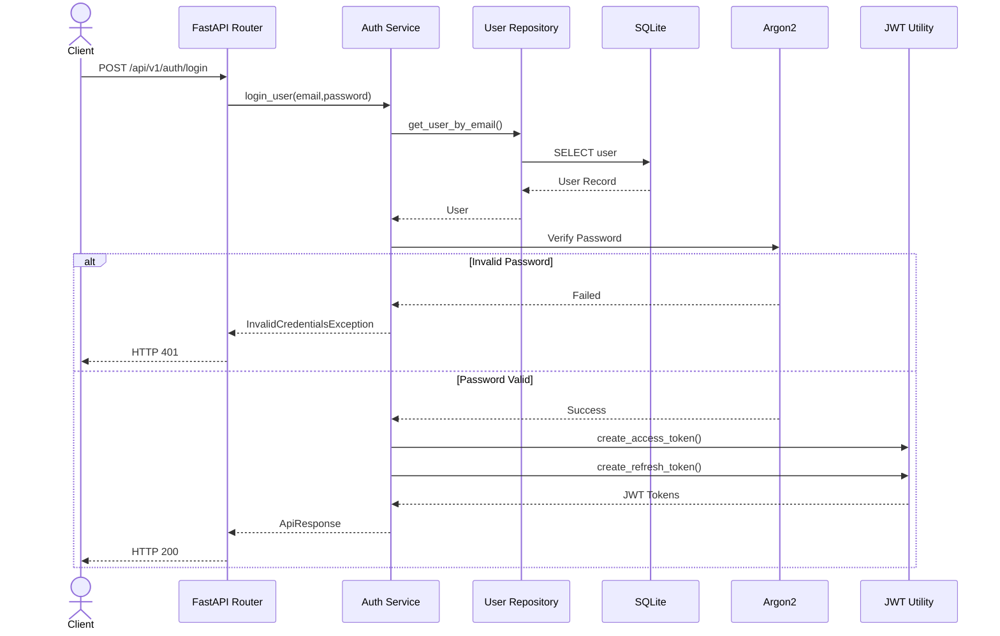

# Authentication Flow Diagram

## Overview

The Authentication module is responsible for securely authenticating users in Career-Ops v2.

It uses modern authentication standards including:

* Argon2 Password Hashing
* JWT Access Token
* JWT Refresh Token
* Stateless Authentication
* Layered Architecture
* Custom Exception Handling

---

# Authentication Flow

---

# Authentication Sequence

---

# Architecture Layers

| Layer            | Responsibility                         |
| ---------------- | -------------------------------------- |
| Client           | Sends authentication request           |
| API Layer        | Accepts HTTP request                   |
| Service Layer    | Authentication business logic          |
| Repository Layer | User retrieval                         |
| Database         | Persistent user storage                |
| Security Layer   | Password verification & JWT generation |
| Response Layer   | Standard API response                  |

---

# Security Components

| Component         | Purpose                         |
| ----------------- | ------------------------------- |
| Argon2            | Password Hashing & Verification |
| JWT               | Stateless Authentication        |
| Access Token      | API Authentication              |
| Refresh Token     | Token Renewal                   |
| Custom Exceptions | Secure error handling           |

---

# HTTP Response Matrix

| Scenario            | HTTP Status |
| ------------------- | ----------: |
| Login Successful    |         200 |
| Invalid Credentials |         401 |
| Unauthorized Token  |         401 |
| Inactive User       |         403 |
| User Not Found      |         404 |
| Duplicate Email     |         409 |
| Duplicate Username  |         409 |

---

# Authentication Module Status

| Feature                  | Status |
| ------------------------ | :----: |
| User Registration        |    ✅   |
| Login                    |    ✅   |
| Argon2 Password Hashing  |    ✅   |
| JWT Access Token         |    ✅   |
| JWT Refresh Token        |    ✅   |
| Exception Handling       |    ✅   |
| Stateless Authentication |    ✅   |
| Layered Architecture     |    ✅   |

---

**Version:** Authentication Module v1.0
**Sprint:** Sprint 8.2 — Authentication Module
