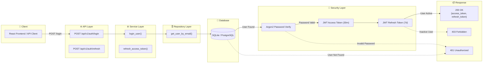
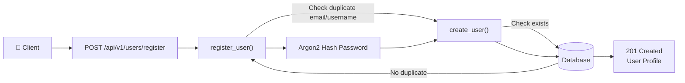
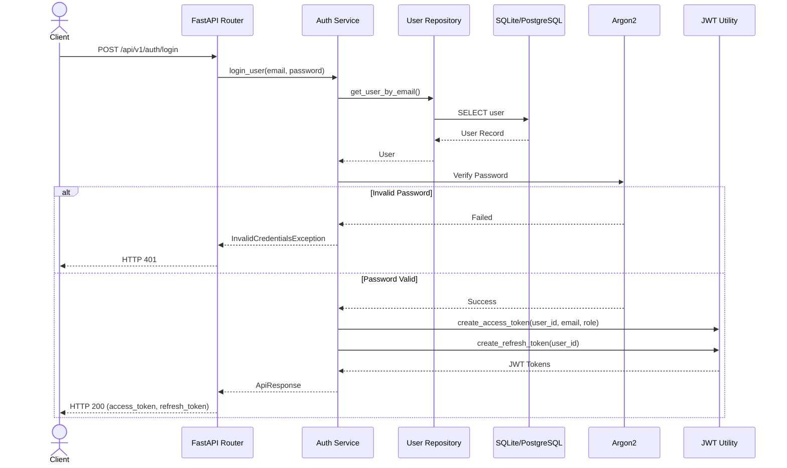

# Authentication Flow Diagram

## Overview

The Authentication module handles user registration, login, token management, and session refresh in Career-Ops v2.

**Implemented features:**
- Argon2 Password Hashing
- JWT Access Token (30 min expiry)
- JWT Refresh Token (7 day expiry)
- Stateless Authentication
- Layered Architecture (Router → Service → Repository → DB)
- Custom Exception Handling

---

# Authentication Flow

---

# Registration Flow

---

# Authentication Sequence

---

# Architecture Layers

| Layer | Responsibility |
|-------|---------------|
| Client | Sends credentials, stores tokens in localStorage |
| API Layer | Routes: `/auth/login`, `/auth/refresh`, `/auth/logout`, `/users/register` |
| Service Layer | `login_user()`, `refresh_access_token()`, business logic |
| Repository Layer | `get_user_by_email()`, `create_user()` |
| Database | Persistent user storage (SQLite dev / PostgreSQL prod) |
| Security Layer | Argon2 password hashing, JWT generation/verification |
| Response Layer | Standardized `ApiResponse` envelope |

---

# Token Specifications

| Token | Lifetime | Payload | Storage |
|-------|----------|---------|---------|
| Access Token | 30 minutes | `sub` (user_id), `email`, `role`, `type`, `iat`, `exp`, `jti` | localStorage / Bearer header |
| Refresh Token | 7 days | `sub` (user_id), `type`, `iat`, `exp`, `jti` | localStorage (sent to /refresh) |

---

# HTTP Response Matrix

| Scenario | HTTP Status | Exception |
|----------|-------------|-----------|
| Login Successful | 200 | — |
| Invalid Credentials | 401 | `InvalidCredentialsException` |
| Expired Token | 401 | `UnauthorizedException` |
| Inactive User | 403 | `InactiveUserException` |
| User Not Found | 404 | `UserNotFoundException` |
| Duplicate Email | 409 | `DuplicateEmailException` |
| Duplicate Username | 409 | `DuplicateUsernameException` |

---

# Auth Module Status

| Feature | Status |
|---------|:------:|
| User Registration | ✅ |
| Login | ✅ |
| Argon2 Password Hashing | ✅ |
| JWT Access Token (30m) | ✅ |
| JWT Refresh Token (7d) | ✅ |
| Token Refresh | ✅ |
| Logout | ✅ |
| Exception Handling | ✅ |
| Stateless Authentication | ✅ |
| Layered Architecture | ✅ |
| RBAC (USER / ADMIN roles) | ✅ |
