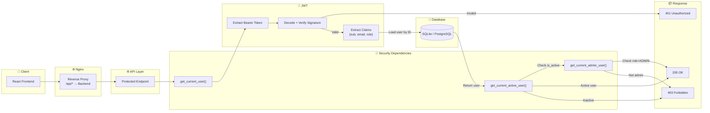
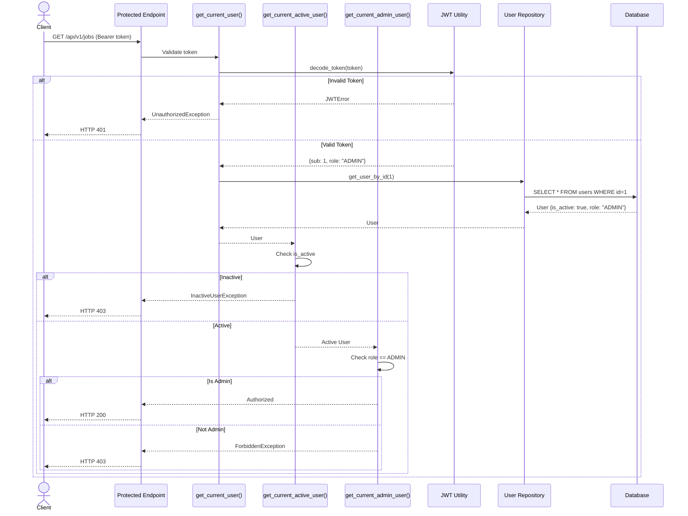
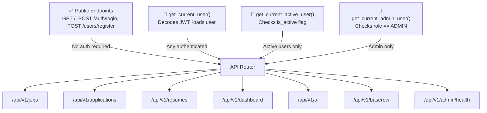

# Authorization Flow Diagram

## Overview

The Authorization module validates every protected request using JWT and Role-Based Access Control (RBAC).

**Implemented:**
- JWT Bearer Authentication on all protected endpoints
- Three dependency levels: `get_current_user` → `get_current_active_user` → `get_current_admin_user`
- Token validation with python-jose
- Current user resolution from database
- Role enforcement (USER / ADMIN)

---

# Authorization Flow

---

# Authorization Sequence

---

# Security Dependency Hierarchy

---

# Security Pipeline

| Step | Function | Output |
|------|----------|--------|
| 1 | `oauth2_scheme` | Bearer token from header |
| 2 | `decode_token()` | JWT claims or `JWTError` |
| 3 | `get_user_by_id(sub)` | User object or `UnauthorizedException` |
| 4 | Check `is_active` | Active user or `InactiveUserException` |
| 5 | Check `role == ADMIN` | Admin user or `ForbiddenException` |
| 6 | Execute endpoint | HTTP 200 with data |

---

# Protected Endpoints

| Endpoint | Auth Required | Role Required |
|----------|---------------|---------------|
| `GET /api/v1/jobs` | ✅ Active User | — |
| `POST /api/v1/jobs` | ✅ Active User | — |
| `GET /api/v1/applications` | ✅ Active User | — |
| `POST /api/v1/resumes/upload` | ✅ Active User | — |
| `GET /api/v1/dashboard/` | ✅ Active User | — |
| `POST /api/v1/ai/ats-score` | ✅ Active User | — |
| `GET /api/v1/admin/health` | ✅ Active User | ADMIN |
| `GET /api/v1/baserow/health` | ✅ Active User | — |

---

# Auth Module Status

| Feature | Status |
|---------|:------:|
| JWT Token Validation | ✅ |
| `get_current_user()` Dependency | ✅ |
| `get_current_active_user()` Dependency | ✅ |
| `get_current_admin_user()` Dependency | ✅ |
| Protected Endpoints (all non-public routes) | ✅ |
| RBAC (USER / ADMIN) | ✅ |
| Custom Exceptions (401, 403, 404, 409) | ✅ |
