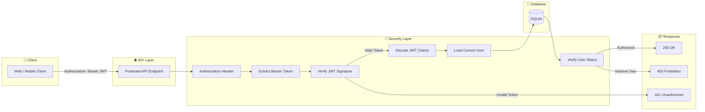
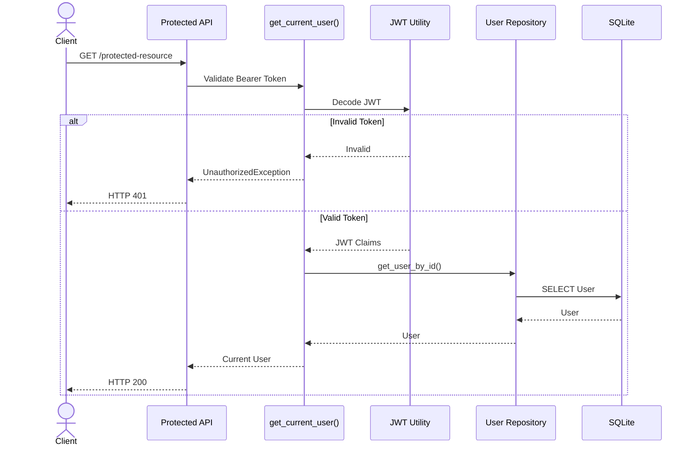

# Authorization Flow Diagram

## Overview

The Authorization module validates every protected request using JWT authentication before allowing access to business resources.

This module provides:

* JWT Bearer Authentication
* Token Validation
* Current User Resolution
* Role-Based Access Control (RBAC) Foundation
* Protected API Access

---

# Authorization Flow

---

# Authorization Sequence

---

# Security Pipeline

| Step | Description             |
| ---- | ----------------------- |
| 1    | Receive Bearer Token    |
| 2    | Verify JWT Signature    |
| 3    | Decode JWT Claims       |
| 4    | Load User from Database |
| 5    | Validate Active Status  |
| 6    | Return Current User     |
| 7    | Execute Protected API   |

---

# Future Expansion

This authorization framework will secure:

* User APIs
* Resume APIs
* Job APIs
* AI Services
* Admin APIs
* n8n APIs

---

# Sprint Status

| Feature                  | Status |
| ------------------------ | :----: |
| JWT Validation           |    ⏳   |
| Current User Dependency  |    ⏳   |
| Protected Endpoints      |    ⏳   |
| RBAC Foundation          |    ⏳   |
| Authorization Middleware |    ⏳   |

---

**Sprint:** Sprint 9 — Authorization & Security Foundation
