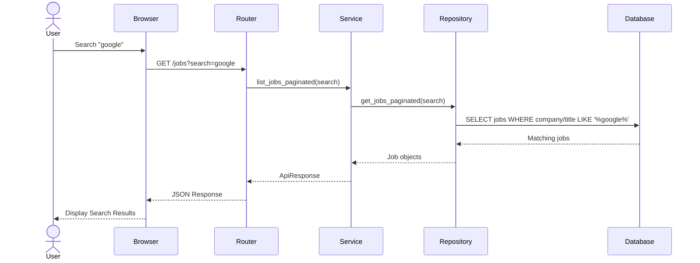

# Job Search Sequence Diagram

Version: 1.0

Status: Active

---

# Purpose

This sequence diagram illustrates how a job search request flows through the Career-Ops v2 backend.

---

# Sequence Diagram

---

# Flow Description

1. User searches for a keyword.
2. Browser sends a GET request.
3. Router validates request parameters.
4. Service executes business logic.
5. Repository constructs SQL query.
6. Database returns matching records.
7. Service converts ORM models into response schemas.
8. Router returns standardized API response.

---

# Current Search Fields

- Company
- Job Title

---

# Future Search Fields

- Skills
- Location
- Salary
- Job Type
- Experience
- Remote Status

---

# Engineering Principles

- Repository owns SQL.
- Service owns business logic.
- Router owns HTTP.
- Standard API responses.
- Search is pagination-aware.