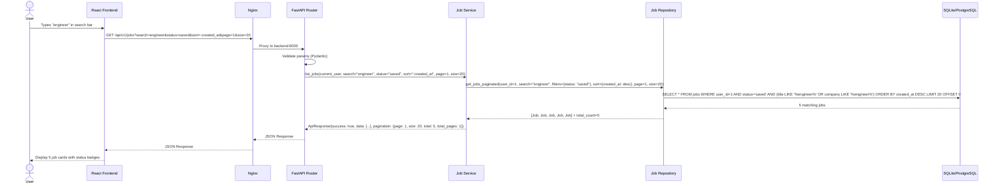
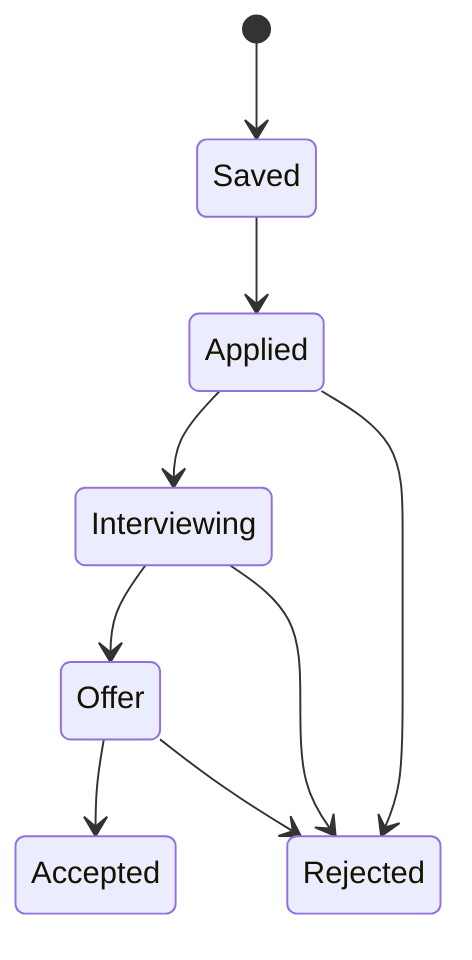

# Job Search Sequence Diagram

Version: 2.0

Status: Active

---

# Purpose

This sequence diagram illustrates how a job search request flows through the Career-Ops v2 backend with full filtering, sorting, and pagination.

---

# Sequence Diagram

---

# Search & Filter Options

| Parameter | Type | Example | Description |
|-----------|------|---------|-------------|
| `search` | string | `engineer` | Full-text search on title + company |
| `status` | string | `saved` | Filter by status: saved, applied, interviewing, offer, rejected, accepted |
| `company` | string | `Google` | Filter by company name |
| `sort` | string | `-created_at` | Sort field (+ for asc, - for desc) |
| `page` | integer | `1` | Page number (1-indexed) |
| `size` | integer | `20` | Items per page (default: 20) |

---

# Job Status Lifecycle

---

# Flow Description

1. User types a search query in the React frontend
2. Frontend sends GET request with query params through Nginx proxy
3. FastAPI Router validates all parameters via Pydantic schemas
4. Service Layer applies business logic (ownership, permissions)
5. Repository constructs SQL query with search, filter, sort, and pagination
6. Database returns matching job records
7. Response is wrapped in standardized `ApiResponse` with pagination metadata

---

# Current Search Fields

- Title (LIKE search)
- Company (LIKE search)
- Status (exact match)
- Combined: title + company across all statuses

---

# Engineering Principles

- Repository owns all SQL queries
- Service owns business logic (ownership validation)
- Router owns HTTP (param validation via Pydantic)
- All responses use `ApiResponse` envelope
- Search is pagination-aware with total counts
- Filtering uses query parameters, not path parameters
