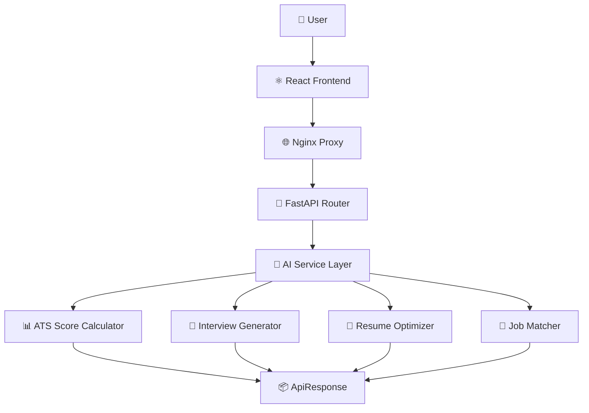
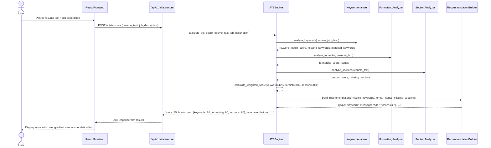
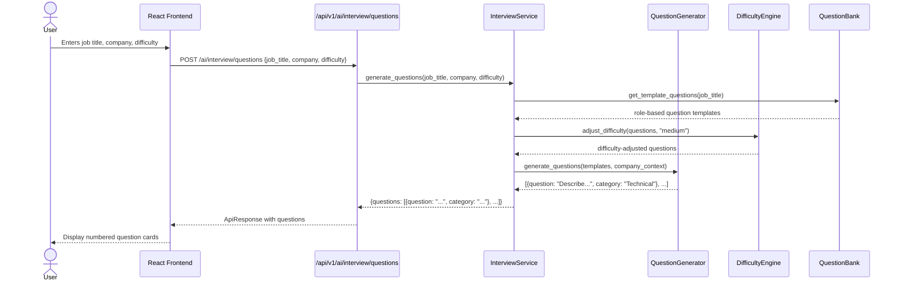
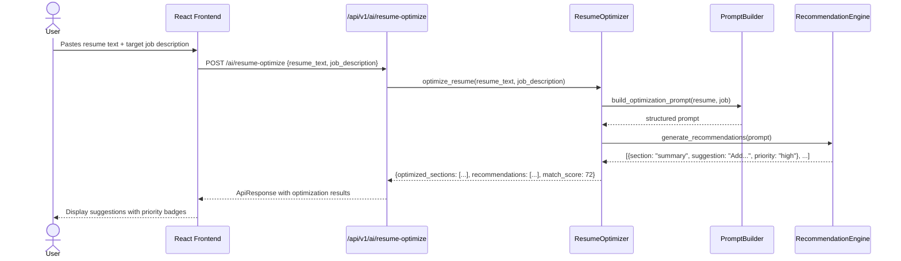
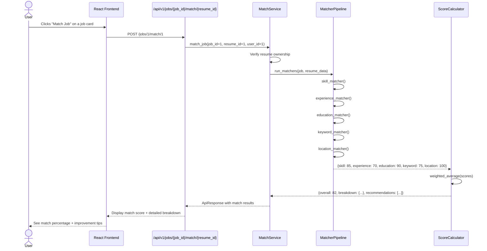

# AI Matching & Career Intelligence Sequence

Version: 1.0

Status: Active

---

# Purpose

This diagram illustrates how the AI services process requests for ATS scoring, interview question generation, and resume optimization within Career-Ops v2.

---

# AI Service Architecture

---

# ATS Score Calculation

---

# Interview Question Generation

---

# Resume Optimization

---

# Job Matching

---

# AI Module Status

| Service | Endpoint | Status |
|---------|----------|:------:|
| ATS Score | `POST /api/v1/ai/ats-score` | ✅ |
| Interview Questions | `POST /api/v1/ai/interview/questions` | ✅ |
| Resume Optimization | `POST /api/v1/ai/resume-optimize` | ✅ |
| Job Matching | `POST /api/v1/jobs/{id}/match/{resume_id}` | ✅ |
