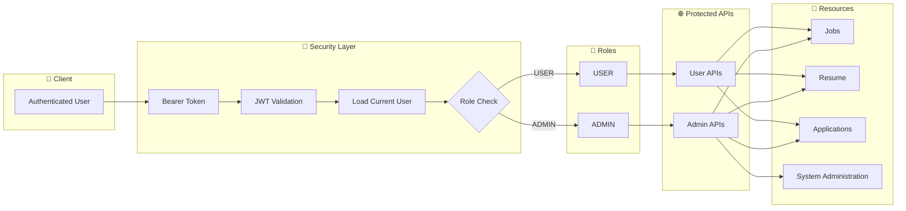
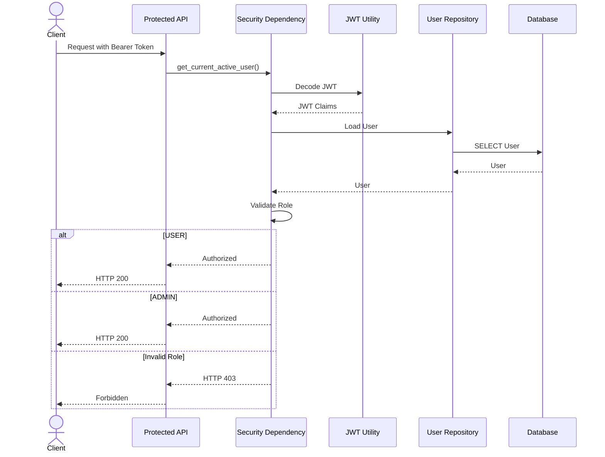

# Role-Based Access Control (RBAC)

## Overview

The RBAC module controls access to protected resources based on authenticated user roles.

Career-Ops follows a layered authorization model:

- Authentication (JWT)
- Authorization (RBAC)
- Business Logic
- Resource Access

---

# RBAC Architecture



---

# Authorization Sequence



---

# Current Roles

| Role | Description |
|------|-------------|
| USER | Standard authenticated user |
| ADMIN | Administrative user |

---

# Future Roles

The RBAC architecture is designed for future expansion.

Possible roles include:

- RECRUITER
- MODERATOR
- PREMIUM_USER
- SUPER_ADMIN

No architectural changes will be required to support additional roles.

---

# Security Pipeline

```text
Login
    │
JWT
    │
Bearer Token
    │
JWT Validation
    │
Current User
    │
Role Validation
    │
Protected API
```

---

# Sprint Status

| Feature | Status |
|---------|:------:|
| JWT Authentication | ✅ |
| Protected APIs | ✅ |
| Current User | ✅ |
| RBAC Foundation | 🔄 |
| Admin Authorization | ⏳ |
| Refresh Token Flow | ⏳ |

---

**Sprint:** Sprint 9.2 — Role-Based Access Control