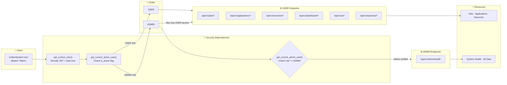
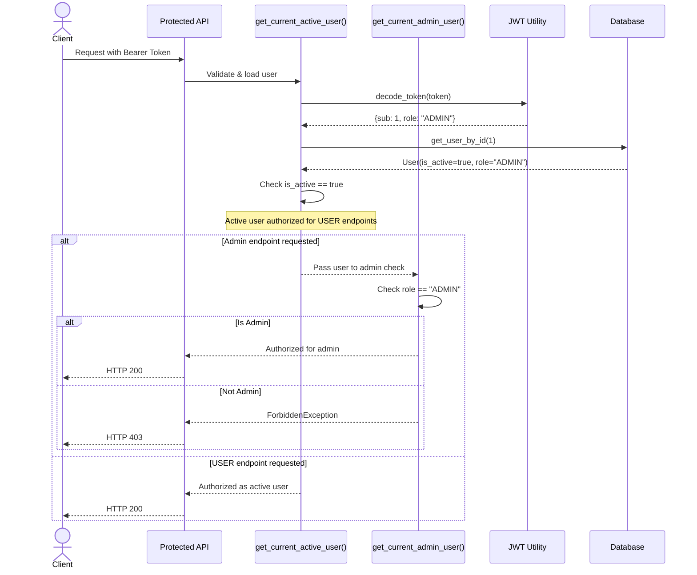

# Role-Based Access Control (RBAC)

## Overview

The RBAC module controls access to protected resources based on authenticated user roles and JWT claims.

**Implemented:**
- `get_current_user()` — JWT validation + user loading
- `get_current_active_user()` — Active status check
- `get_current_admin_user()` — Admin role enforcement
- Roles: USER, ADMIN

---

# RBAC Architecture



---

# Role Permissions Matrix

| Endpoint | Public | USER | ADMIN |
|----------|:------:|:----:|:-----:|
| `GET /` | ✅ | — | — |
| `POST /users/register` | ✅ | — | — |
| `POST /auth/login` | ✅ | — | — |
| `POST /auth/refresh` | ✅ | — | — |
| `GET /users/me` | — | ✅ | ✅ |
| `GET/POST /jobs` | — | ✅ | ✅ |
| `GET/PATCH/DELETE /jobs/{id}` | — | ✅ (own) | ✅ |
| `GET/POST /applications` | — | ✅ | ✅ |
| `GET/POST /resumes` | — | ✅ | ✅ |
| `GET /dashboard` | — | ✅ | ✅ |
| `POST /ai/*` | — | ✅ | ✅ |
| `GET /admin/health` | — | — | ✅ |
| `GET /baserow/*` | — | ✅ | ✅ |

---

# Authorization Sequence



---

# Current Roles

| Role | Description | Can Access |
|------|-------------|------------|
| `USER` | Standard authenticated user | All data endpoints (own resources) |
| `ADMIN` | Administrative user | All USER endpoints + admin endpoints |

---

# Security Pipeline

```text
Request
  │
  ▼
OAuth2PasswordBearer (extract token from Authorization header)
  │
  ▼
get_current_user()
  ├── decode_token(token) → JWT claims
  ├── get_user_by_id(sub) → User object
  └── Returns user or raises UnauthorizedException
  │
  ▼
get_current_active_user()
  ├── Checks user.is_active == true
  └── Raises InactiveUserException if not
  │
  ▼
get_current_admin_user() [admin endpoints only]
  ├── Checks user.role == "ADMIN"
  └── Raises ForbiddenException if not
  │
  ▼
Endpoint executes with current_user injected
```

---

# RBAC Module Status

| Feature | Status |
|---------|:------:|
| JWT Authentication | ✅ |
| `get_current_user()` | ✅ |
| `get_current_active_user()` | ✅ |
| `get_current_admin_user()` | ✅ |
| Protected APIs (all non-public routes) | ✅ |
| User-resource ownership checks | ✅ |
| Custom 401/403 Exceptions | ✅ |
