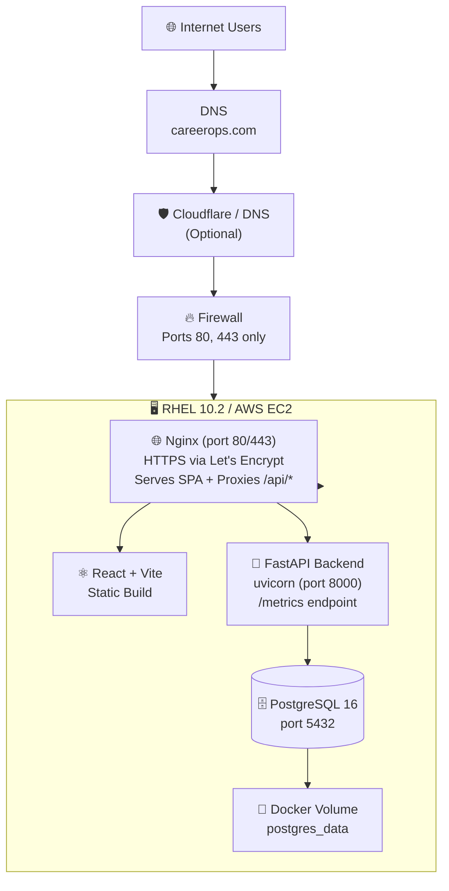
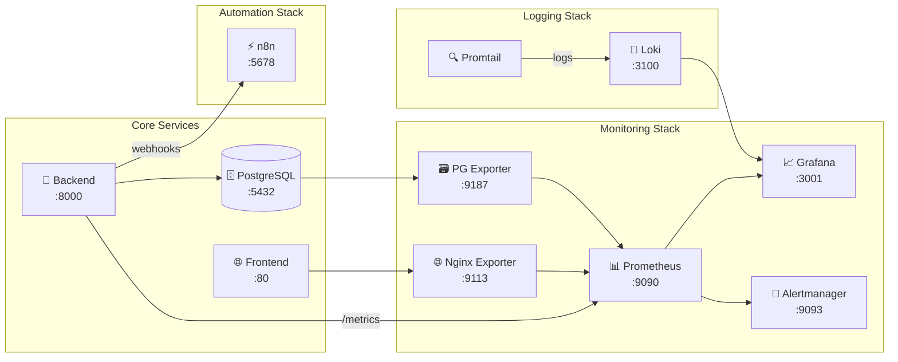
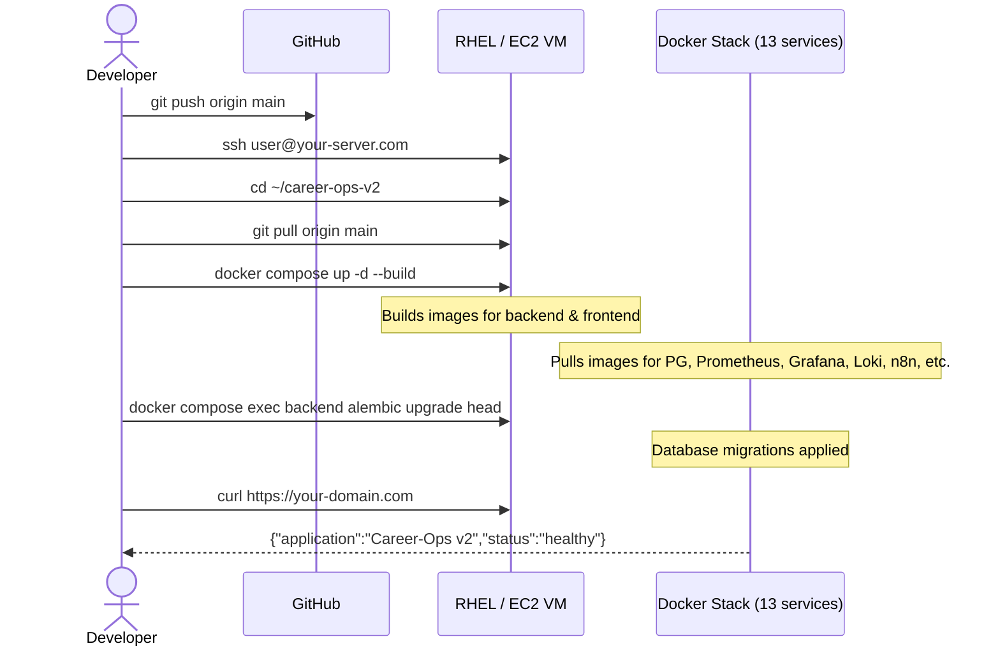

# Deployment Diagram

Version: 2.0
Status: Active
Last Updated: 2026-07-16

---

## 🎯 Purpose

This diagram describes the production deployment architecture for Career-Ops v2 — 13 Docker Compose services running on RHEL 10.2 or AWS EC2 with full monitoring, logging, alerting, and workflow automation.

---

## 🌐 Internet-Facing Architecture (HTTPS + Domain)



---

## 🐳 Full Docker Compose Stack (13 Services)



---

## 🪜 Deployment Flow for Production



---

## 🛡️ Security Group / Firewall Rules

| Port | Protocol | Public | Purpose | Exposed To |
|:----:|:--------:|:------:|---------|:----------:|
| 22 | TCP | ✅ | SSH | Your IP only (⛔ restrict in production) |
| 80 | TCP | ✅ | HTTP → HTTPS redirect | 0.0.0.0/0 |
| 443 | TCP | ✅ | HTTPS (SPA + API) | 0.0.0.0/0 |
| 5432 | TCP | ❌ | PostgreSQL | Docker network only |
| 8000 | TCP | ❌ | FastAPI Backend | Docker network only |
| 3001 | TCP | ❌ | Grafana | Docker network only |
| 9090 | TCP | ❌ | Prometheus | Docker network only |
| 9093 | TCP | ❌ | Alertmanager | Docker network only |
| 3100 | TCP | ❌ | Loki | Docker network only |
| 5678 | TCP | ❌ | n8n | Docker network only |

> **Rule:** Only ports 80 and 443 are exposed to the public internet. Everything else is internal to the Docker network.

---

## 📦 Service Configuration Summary

| Service | Image | Restart | Healthcheck | Depends On |
|---------|-------|:-------:|:-----------:|:----------:|
| `postgres` | `postgres:16-alpine` | always | ✅ pg_isready | — |
| `backend` | Custom (multi-stage) | always | — | postgres (healthy) |
| `frontend` | Custom (Bun → Nginx) | always | — | backend |
| `prometheus` | `prom/prometheus:v3.2.1` | always | — | backend, alertmanager |
| `grafana` | `grafana/grafana:11.6.0` | always | — | prometheus |
| `alertmanager` | `prom/alertmanager:v0.28.1` | always | — | — |
| `postgres-exporter` | `prometheuscommunity/postgres-exporter` | always | — | postgres (healthy) |
| `nginx-exporter` | `nginx/nginx-prometheus-exporter:1.5.0` | always | — | frontend |
| `loki` | `grafana/loki:3.4.2` | always | — | — |
| `promtail` | `grafana/promtail:3.4.2` | always | — | loki |
| `n8n` | `n8nio/n8n:1.88.0` | always | — | — |

---

## 🔧 Environment Variables Required

| Variable | Source | Example |
|----------|--------|---------|
| `POSTGRES_PASSWORD` | `openssl rand -base64 24` | Strong random password |
| `SECRET_KEY` | `openssl rand -hex 32` | 64-char hex string |
| `LLM_API_KEY` | [Google AI Studio](https://aistudio.google.com/apikey) | Gemini API key |
| `GRAFANA_ADMIN_PASSWORD` | `openssl rand -base64 16` | Grafana admin password |
| `N8N_ENCRYPTION_KEY` | `openssl rand -hex 32` | n8n credential encryption |
| `CORS_ORIGINS` | Your domain | `https://careerops.com` |

---

## 🧪 Health Check Verification

```bash
# After deployment, run these to verify everything:

# Core services
curl https://your-domain.com/                    # Frontend (200)
curl https://your-domain.com/api/v1/               # API (200)
curl https://your-domain.com/api/v1/admin/health   # Admin health

# Metrics (internal)
curl http://localhost:8000/metrics | head          # Backend metrics
curl http://localhost:9090/-/ready                 # Prometheus ready
curl http://localhost:3001/api/health              # Grafana health
curl http://localhost:9093/-/ready                 # Alertmanager ready
curl http://localhost:3100/ready                   # Loki ready

# Full flow: register + login + AI
curl -X POST https://your-domain.com/api/v1/users/register -d '{"email":"user@test.com",...}'
curl -X POST https://your-domain.com/api/v1/ai/ats-score -H "Authorization: Bearer $TOKEN" -d '{}'
```

---

## 📚 Related Documents

| Document | Link |
|----------|------|
| 🖥️ RHEL VM Deployment | [`../deployment/rhel-vm-deployment.md`](../deployment/rhel-vm-deployment.md) |
| ☁️ AWS EC2 Deployment | [`../deployment/aws-ec2-deployment.md`](../deployment/aws-ec2-deployment.md) |
| 🌐 RHEL Go-Live Guide (Public Internet) | [`../deployment/rhel-go-live-guide.md`](../deployment/rhel-go-live-guide.md) |
| 🏗️ Master Architecture | [`../architecture/master-architecture-v1.md`](../architecture/master-architecture-v1.md) |
| 🐳 Docker Compose Config | [`../../docker-compose.yml`](../../docker-compose.yml) |
| 🔧 Environment Template | [`../../.env.example`](../../.env.example) |
