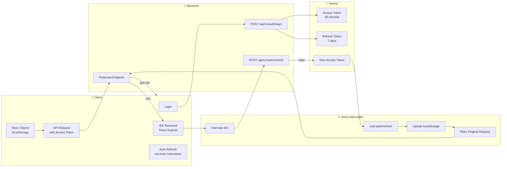
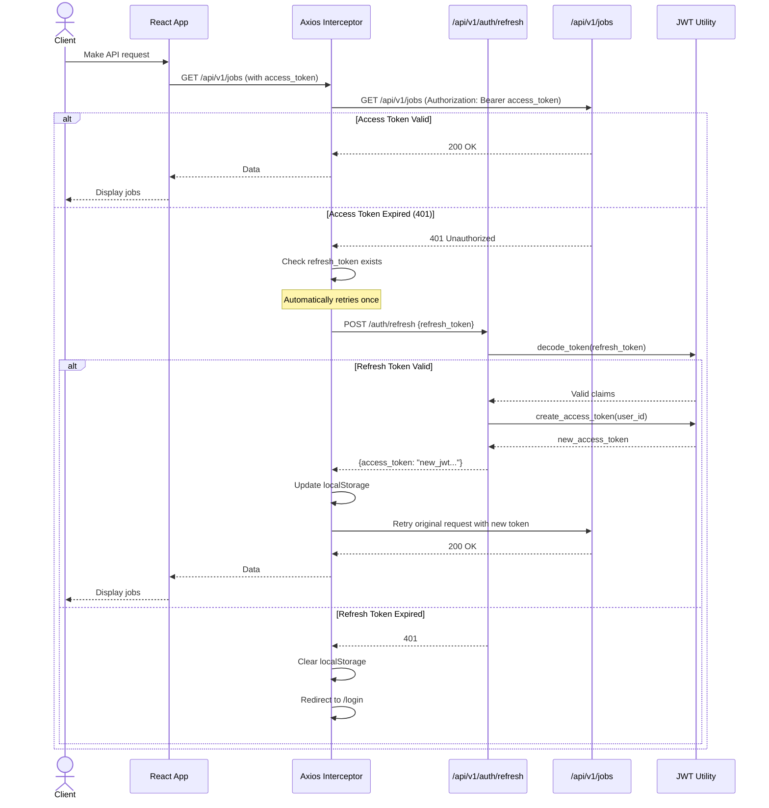

# Refresh Token Flow

## Overview

The Refresh Token module allows clients to obtain a new Access Token without requiring the user to log in again. The Axios interceptor on the frontend handles this automatically when a 401 response is received.

**Implemented:**
- Access Token: 30 minutes
- Refresh Token: 7 days
- Automatic refresh via Axios interceptor
- JWT signature verification on every request

---

# Authentication Lifecycle



---

# Refresh Token Sequence



---

# Token Specifications

| Token | Lifetime | Payload | Used For |
|-------|----------|---------|----------|
| Access Token | 30 minutes | `sub` (user_id), `email`, `role`, `type: "access"`, `iat`, `exp`, `jti` | API Authorization (Bearer header) |
| Refresh Token | 7 days | `sub` (user_id), `type: "refresh"`, `iat`, `exp`, `jti` | Generating new access tokens |

---

# Frontend Auto-Refresh (Axios Interceptor)

```
Request → 401 → Check refresh_token
                     ↓
              Has token? ──No──→ Redirect to /login
                     │
                    Yes
                     │
              POST /auth/refresh
                     │
               ┌─────┴─────┐
              Valid       Invalid
               │            │
          Store new       Clear tokens
          access_token    Redirect /login
               │
          Retry original
          request
```

---

# Security Rules

- Access Token cannot be used to generate a new Access Token
- Refresh Token must contain `type: "refresh"` claim
- Expired tokens are rejected with 401
- Invalid JWT signature is rejected
- Frontend auto-refresh only retries once per request
- If refresh fails, all tokens are cleared and user is redirected to login

---

# Token Flow Status

| Feature | Status |
|---------|:------:|
| Access Token generation | ✅ |
| Refresh Token generation | ✅ |
| Token refresh endpoint | ✅ |
| JWT signature verification | ✅ |
| Frontend auto-refresh interceptor | ✅ |
| Token expiry handling | ✅ |
| Logout (clear tokens) | ✅ |
| Refresh Token rotation | 🔜 Planned |
| Token revocation | 🔜 Planned |
