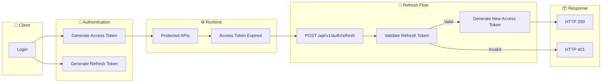
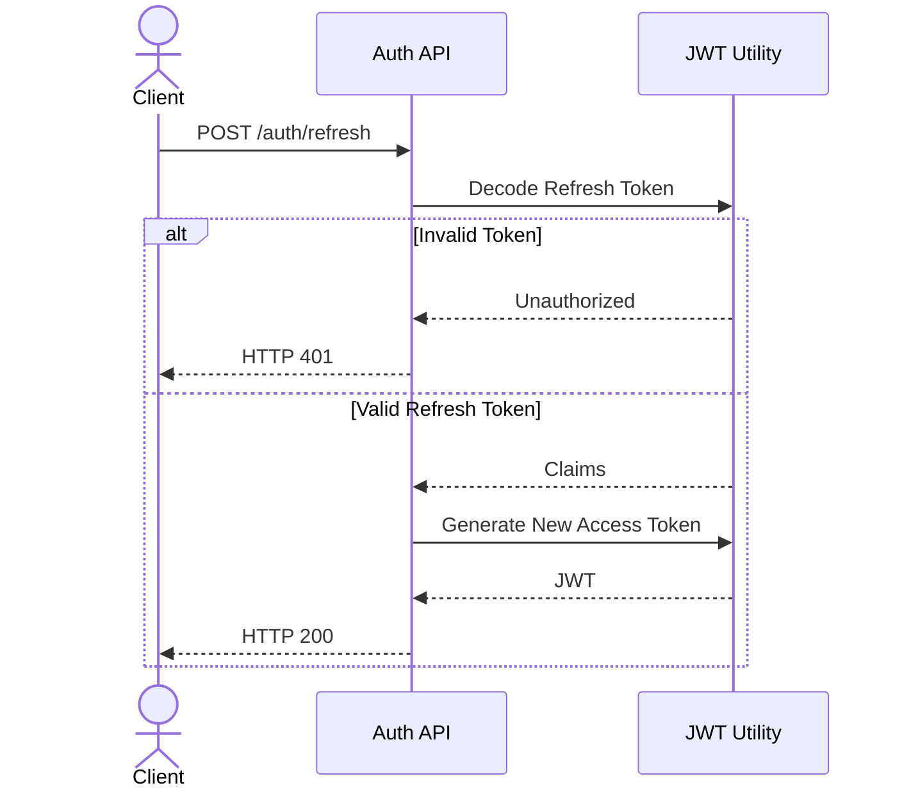

# Refresh Token Flow

## Overview

The Refresh Token module allows clients to obtain a new Access Token without requiring the user to log in again.

The Refresh Token is long-lived and can only be used to generate a new Access Token.

---

# Authentication Lifecycle

---

# Refresh Token Sequence

---

# Token Lifecycle

| Token | Lifetime | Purpose |
|--------|----------|----------|
| Access Token | 30 Minutes | Access Protected APIs |
| Refresh Token | 7 Days | Generate New Access Token |

---

# Security Rules

- Access Token cannot refresh itself.
- Refresh Token must contain `type = refresh`.
- Expired Refresh Token is rejected.
- Invalid signature is rejected.
- JWT signature is always verified.
- Refresh endpoint never returns a new Refresh Token (v1).

---

# Future Enhancements

- Refresh Token Rotation
- Token Revocation
- Redis Session Store
- Multi-device Sessions
- Logout Everywhere
- Device Fingerprinting

---

# Sprint Status

| Feature | Status |
|---------|:------:|
| Login | ✅ |
| JWT | ✅ |
| RBAC | ✅ |
| Refresh Token | 🔄 |
| Logout | ⏳ |
| Token Rotation | ⏳ |

---

**Sprint:** Sprint 9.3 — Refresh Token Flow