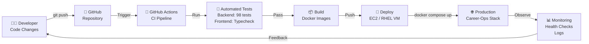
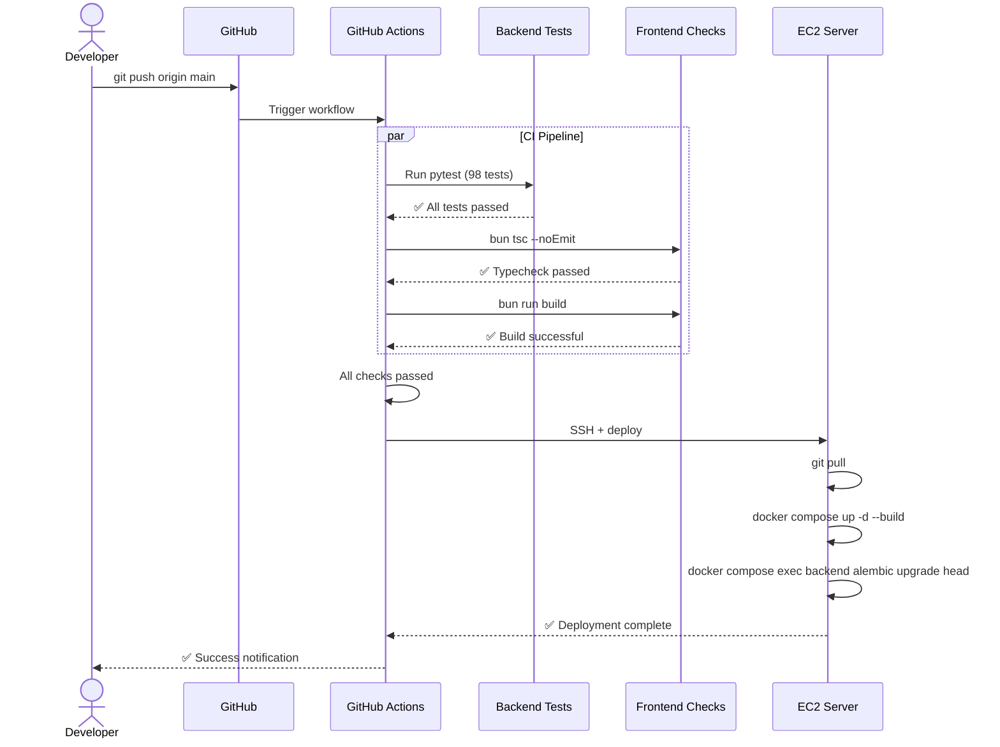
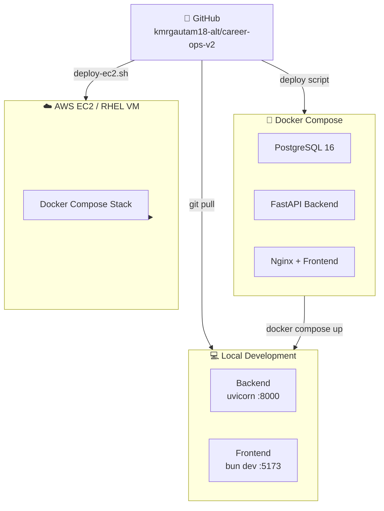

# CI/CD Pipeline

Version: 1.0

Status: Active

---

# Purpose

This diagram illustrates the CI/CD pipeline for Career-Ops v2 — from code push to production deployment.

---

# CI/CD Pipeline Overview



---

# GitHub Actions Workflow



---

# Pipeline Stages

| Stage | Tool | Duration | Description |
|-------|------|----------|-------------|
| 1. Trigger | GitHub | Instant | Push to `main` branch |
| 2. Backend Tests | pytest | ~12s | 98 tests (auth, jobs, apps, resume, AI, extraction) |
| 3. Frontend Typecheck | `tsc -b` | ~5s | TypeScript 6 strict mode |
| 4. Frontend Build | Vite | ~3s | Production build → `dist/` |
| 5. Deploy | `deploy-ec2.sh` | ~30s | RSync code → Docker Compose → Migrations |

---

# Deployment Targets



---

# Current CI Status

| Check | Status |
|-------|:------:|
| Backend tests (98) | ✅ Passing |
| Frontend typecheck | ✅ 0 errors |
| Frontend production build | ✅ Successful |
| Docker Compose build | ✅ Verified |
| Deploy scripts | ✅ Ready (EC2 + RHEL) |
| Automated GitHub Actions | 🔜 Planned |

---

# Deploy Scripts

| Script | Target | Command |
|--------|--------|---------|
| `scripts/deploy-ec2.sh` | AWS EC2 | `EC2_HOST=... bash scripts/deploy-ec2.sh` |
| `scripts/deploy-rhel.sh` | RHEL 10.2 VM | `sudo bash scripts/deploy-rhel.sh` |
| `scripts/preview.sh` | Local dev | `bash scripts/preview.sh` |

---

# Deployment Commands

```bash
# Full stack with Docker
docker compose up -d --build

# Run migrations
docker compose exec backend alembic upgrade head

# View logs
docker compose logs -f backend

# Update and redeploy
git pull && docker compose up -d --build
```
