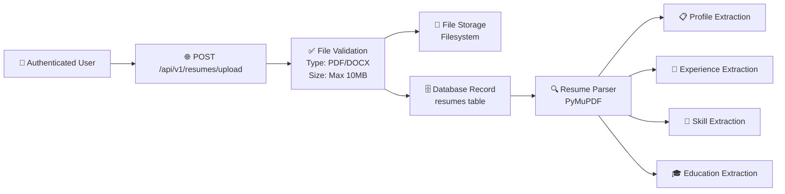
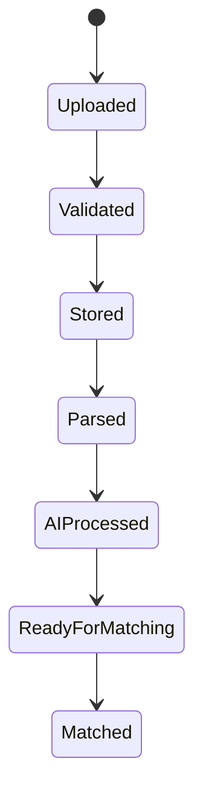
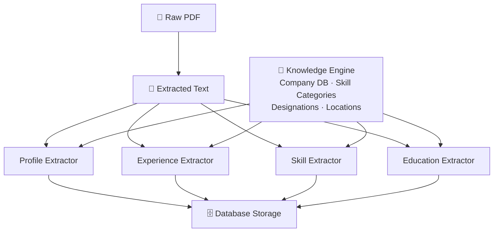

# Resume Engine Architecture

Version: 2.0

Status: Active

---

# Overview

The Resume Engine handles uploading, validating, storing, parsing, and managing user resumes. It includes AI-powered analysis, ATS scoring, and skill extraction.

---

# Resume Upload Flow



---

# Resume Lifecycle



---

# Module Status

| Module | Status | Description |
|--------|--------|-------------|
| Upload API | ✅ | POST /api/v1/resumes/upload |
| File Validation | ✅ | PDF/DOCX type check, size limit |
| File Storage | ✅ | Filesystem storage with unique names |
| Database CRUD | ✅ | Create, read, update, delete resumes |
| Resume Download | ✅ | GET /api/v1/resumes/{id}/download |
| Resume Preview | ✅ | GET /api/v1/resumes/{id}/preview |
| Resume Listing | ✅ | GET /api/v1/resumes (paginated) |
| Profile Extraction | ✅ | Name, email, phone, location, summary |
| Experience Extraction | ✅ | Company, designation, dates, description |
| Skill Extraction | ✅ | Skills with categories and confidence |
| Education Extraction | ✅ | Degree, institution, dates, grades |
| Confidence Scoring | ✅ | Each extraction has a confidence score |
| ATS Scoring | ✅ | AI-powered resume vs job analysis |
| Resume Optimization | ✅ | AI-powered improvement suggestions |
| Job Matching | ✅ | Score resumes against job requirements |

---

# Storage Architecture

```
uploads/
└── resumes/
    └── {user_id}/
        └── {uuid}_{original_name}.pdf
```

- Files stored by user ID for isolation
- UUID prefixed to prevent name collisions
- Original name preserved for display
- Migration-ready for S3/GCS/Azure Blob

---

# Supported File Types

| Format | Support | Parser |
|--------|---------|--------|
| PDF | ✅ | PyMuPDF |
| DOCX | ✅ | python-docx (planned) |

---

# Extraction Pipeline



---

# Knowledge Base

The extraction engine uses a curated knowledge base stored in `backend/app/resources/`:

| Resource | Purpose |
|----------|---------|
| `companies/` | Known company names for matching |
| `designations/` | Common job titles and roles |
| `education/` | Degrees, institutions, specializations |
| `locations/` | Cities, states, countries |
| `skills/` | Skill categories (programming, cloud, DevOps, etc.) |
