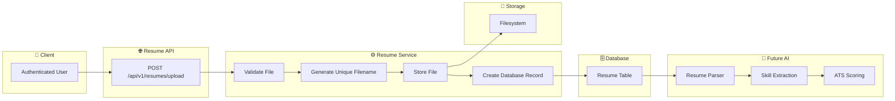
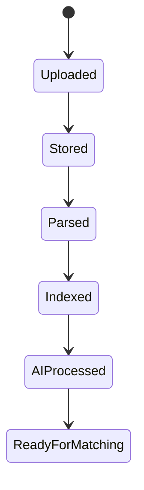

# Resume Engine Architecture

## Overview

The Resume Engine is responsible for securely uploading, validating, storing, parsing, and managing user resumes.

The architecture is designed to support future AI-powered resume analysis, ATS scoring, job matching, and resume optimization.

---

# Resume Upload Flow

---

# Resume Lifecycle

---

# Module Responsibilities

| Layer | Responsibility |
|--------|----------------|
| API | Receive upload requests |
| Service | Validation & business logic |
| Repository | Database operations |
| Storage | File persistence |
| Database | Resume metadata |
| AI | Resume parsing & analysis |

---

# Storage Strategy

The Resume Engine stores:

- Resume metadata in the database.
- Resume files on the filesystem.

This design allows future migration to:

- Amazon S3
- Azure Blob Storage
- Google Cloud Storage

without changing the database schema.

---

# Supported File Types (v1)

- PDF
- DOCX

---

# Future Features

- Resume Versioning
- Resume Preview
- AI Resume Analysis
- ATS Score
- Resume Improvement Suggestions
- Job Matching
- Resume Search
- OCR Support
- Multi-language Parsing

---

# Sprint Status

| Feature | Status |
|---------|:------:|
| Upload API | ⏳ |
| Validation | ⏳ |
| Storage | ⏳ |
| Database | ⏳ |
| Parsing | 🔜 |
| AI Matching | 🔜 |

---

**Sprint:** Sprint 10.1 — Resume Engine Foundation