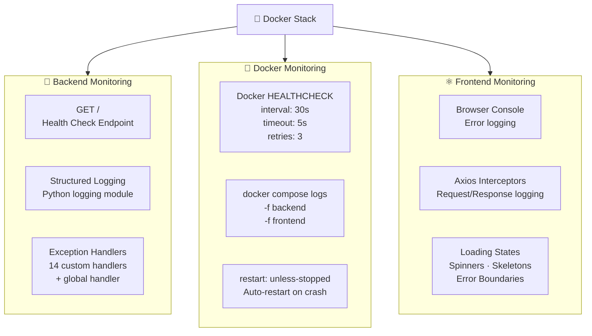
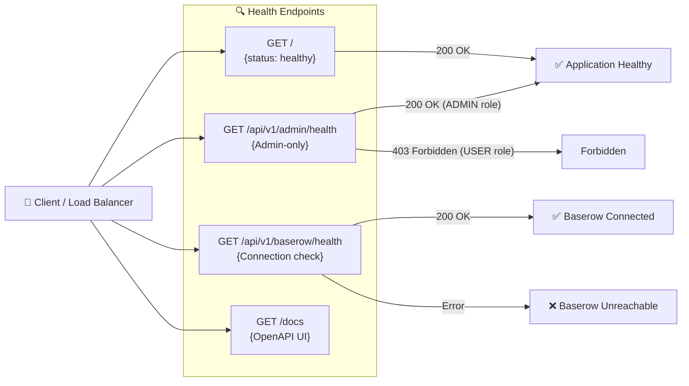

# Monitoring Architecture

Version: 1.0

Status: Active

---

# Purpose

Career-Ops v2 includes built-in observability through structured logging, health check endpoints, and Docker health monitoring.

---

# Monitoring Overview



---

# Health Check Endpoints



---

# Docker Health Check

```dockerfile
HEALTHCHECK --interval=30s --timeout=5s --start-period=15s --retries=3 \
    CMD python -c "import urllib.request; \
        urllib.request.urlopen('http://127.0.0.1:8000/').read()"
```

| Parameter | Value | Description |
|-----------|-------|-------------|
| `interval` | 30s | Check every 30 seconds |
| `timeout` | 5s | Max time per check |
| `start-period` | 15s | Grace period at container start |
| `retries` | 3 | Mark unhealthy after 3 failures |

---

# Logging Structure

```python
import logging

logging.basicConfig(
    level=logging.INFO,
    format="%(asctime)s | %(levelname)s | %(name)s | %(message)s",
)
```

| Component | Logger Name | Log Level | Events Logged |
|-----------|-------------|-----------|---------------|
| Exception Handler | `careerops.exceptions` | ERROR | All unhandled exceptions |
| Auth Service | `careerops.auth` | INFO | Login attempts, registrations |
| Resume Service | `careerops.resume` | INFO | Uploads, parsing results |
| AI Service | `careerops.ai` | INFO | ATS scores, interview generations |
| API Layer | `uvicorn` | INFO | HTTP requests (method, path, status) |

---

# Exception Handling

| Exception | HTTP Status | Handler |
|-----------|-------------|---------|
| `JobNotFoundException` | 404 | `job_not_found_handler` |
| `ApplicationNotFoundException` | 404 | `application_not_found_handler` |
| `DuplicateEmailException` | 409 | `duplicate_email_handler` |
| `DuplicateUsernameException` | 409 | `duplicate_username_handler` |
| `UserNotFoundException` | 404 | `user_not_found_handler` |
| `InvalidCredentialsException` | 401 | `invalid_credentials_handler` |
| `InactiveUserException` | 403 | `inactive_user_handler` |
| `UnauthorizedException` | 401 | `unauthorized_handler` |
| `ResumeNotFoundException` | 404 | `resume_not_found_handler` |
| `InvalidResumeFileException` | 400 | `invalid_resume_file_handler` |
| `UnsupportedResumeTypeException` | 415 | `unsupported_resume_type_handler` |
| `ResumeTooLargeException` | 413 | `resume_too_large_handler` |
| Any other `Exception` | 500 | `global_exception_handler` |

---

# Monitoring Status

| Feature | Status |
|---------|:------:|
| Health check endpoint (`GET /`) | ✅ |
| Admin health endpoint | ✅ |
| Baserow health endpoint | ✅ |
| Docker HEALTHCHECK | ✅ |
| Auto-restart (`unless-stopped`) | ✅ |
| Structured logging | ✅ |
| Custom exception handlers | ✅ |
| Global exception fallback | ✅ |
| Frontend loading states | ✅ |
| Frontend error handling | ✅ |
| Prometheus metrics | 🔜 Planned |
| Grafana dashboard | 🔜 Planned |
| Sentry error tracking | 🔜 Planned |
