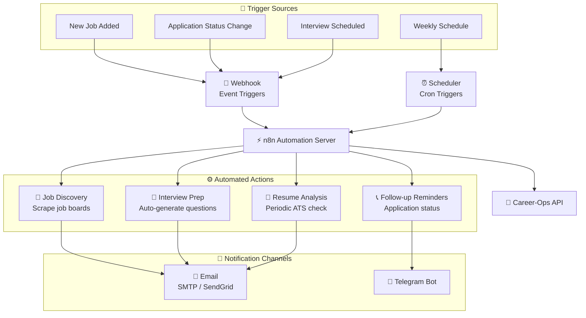
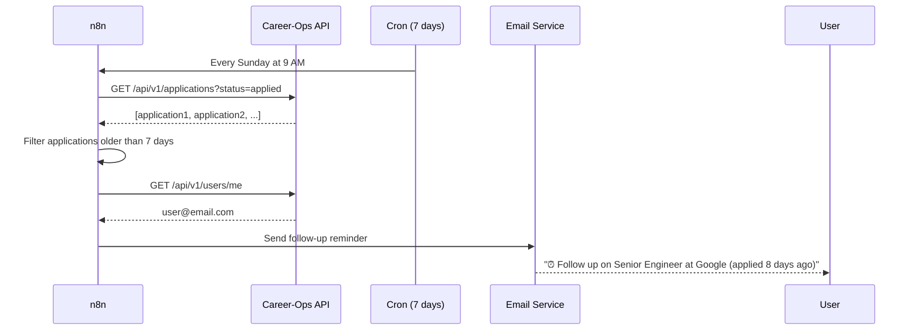
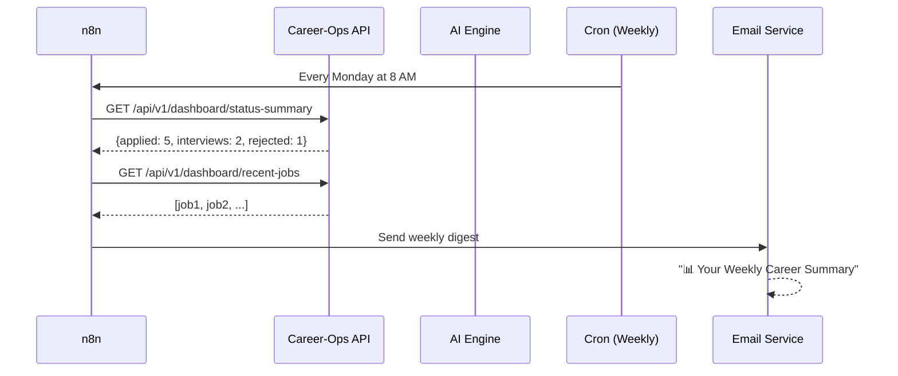

# n8n Workflow Automation

Version: 1.0

Status: Planned

---

# Purpose

This diagram illustrates planned workflow automation patterns using n8n to extend Career-Ops v2 capabilities with email notifications, job discovery, and scheduled tasks.

---

# Automation Architecture

---

# Example Workflows

## 1. Application Follow-up Reminder

## 2. Weekly Job Search Digest

---

# Planned Webhook Endpoints

| Endpoint | Trigger | Payload |
|----------|---------|---------|
| `POST /api/v1/webhooks/job-created` | New job saved | `{job_id, title, company}` |
| `POST /api/v1/webhooks/application-updated` | Status change | `{app_id, from_status, to_status}` |
| `POST /api/v1/webhooks/interview-scheduled` | New interview | `{app_id, date, round}` |

---

# n8n Integration Status

| Feature | Status |
|---------|:------:|
| Career-Ops REST API | ✅ Ready to consume |
| Webhook endpoints | 🔜 Planned |
| n8n server setup | 🔜 Planned |
| Email notifications | 🔜 Planned |
| Telegram notifications | 🔜 Planned |
| Weekly digest | 🔜 Planned |
| Auto follow-up reminders | 🔜 Planned |
| Automated job discovery | 🔜 Planned |
